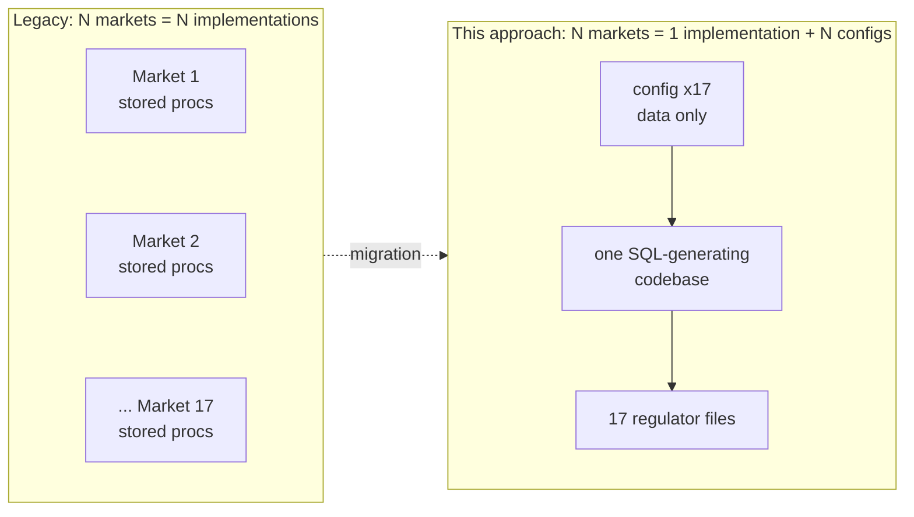

# Overview — Config-Driven Regulatory Reporting

*A high-level briefing for technical decision-makers. It explains what
this approach is, why it exists, and how it compares to the legacy model
of a hand-written SQL stored-procedure estate rebuilt once per market.
For the engineering detail see
[`dataform-example/ARCHITECTURE.md`](dataform-example/ARCHITECTURE.md);
for the maintainer contract see
[`dataform-example/CLAUDE.md`](dataform-example/CLAUDE.md).*

---

## TL;DR

We run **17 regulated gaming markets**. The legacy platform implements
each market as its **own fork** of SQL Server stored procedures,
triggers, SSRS reports and SOAP submission code — the same reporting
logic written, tested and maintained **17 times over 14 years**, each
copy drifting from the others.

This project replaces that with **one codebase** where *every market
difference is data, and every piece of logic exists exactly once*. A new
market is a configuration entry, not a new implementation. A regulator
rule change is a one-line, audit-tagged diff. Correctness is proven in
**seconds on a laptop** before anything touches the cloud.

The result: the cost of the 18th market approaches zero, the 17 markets
can no longer silently diverge, and every regulatory constraint carries
its clause reference as a first-class, testable object.

---

## The problem with 17 stored-procedure forks

The legacy estate works, but its economics get worse every year:

- **Linear cost, forever.** Every new market, every new report, every
  regulator rule change is re-done per market. Effort scales with
  markets × changes, not with the number of *distinct ideas*.
- **Silent divergence.** Seventeen copies of "the same" void-handling or
  tax logic drift apart through years of local fixes. Nobody can say with
  confidence that market 4 and market 11 treat a voided bet identically —
  because they're different code.
- **Audit by archaeology.** "Why does this column exist?" is answered by
  reading stored-proc comments and asking whoever's been here longest.
  The link from a number in a regulator's file back to the legal clause
  that requires it lives in people's heads.
- **Testing needs the whole stack.** Validating a change means a SQL
  Server environment, representative data, and manual inspection —
  slow, and often skipped under deadline.
- **Change is high-blast-radius and opaque.** Editing a shared proc to
  fix one market can quietly affect others; you find out in production,
  or from a regulator.
- **Onboarding is 17 codebases.** New engineers face a wall of
  market-specific SQL with no single source of truth.

None of this is a failure of the team — it's the ceiling of the
copy-per-market pattern.

---

## The core idea

> **Variance is data. Logic is singular. Correctness is proven before deploy.**

Everything a market does *differently* — its tax rate, whether it reports
voided bets, its player-identifier scheme, its regulator sport/game
codes, its declarative rules, even bespoke data fields — lives as
**configuration** in one place. Everything a market does *the same* —
the SQL that builds submission files, computes tax, enforces rules —
exists **once**, as small pure functions that read the config.

Adding market #18 means adding a config object — the engine already
knows how to build its files, run its rules, and submit them.

---

## What it looks like in practice

The codebase is a strict, one-directional stack — config flows down into
generated SQL, never the reverse:

| Layer | Holds | So that… |
|---|---|---|
| **Config** (`jurisdictions.js`) | Market facts + declarative rules, as data | A market is a data entry, not code |
| **Nomenclature** | Upstream names → canonical taxonomy → regulator codes | Feed messiness and 17 code systems don't cross-multiply |
| **Fields / Filters / Queries** | One SQL expression per concept, composed | The logic exists once, parameterised by config |
| **Rule engine** | Rule *types* → violation SQL | Every regulatory constraint is a testable object |
| **Extensions** | Per-market bespoke data attributes | One market's quirk never widens the shared model |
| **Dialect** | The few genuinely engine-specific SQL bits | Same source runs on BigQuery *and* a local engine |

Two properties fall out of this that the legacy model can't offer:

- **Declarative rules with a built-in audit trail.** A regulatory
  constraint is written as `{ id: "MT-103", type: "zero_when", ... }`
  where the `id` is the regulator's clause reference. It compiles to a
  pipeline-blocking check named after that clause. A failure points
  straight at the law it enforces; a rule change is a one-line git diff
  with the clause in it.
- **A full offline test harness.** The entire pipeline — every model,
  every rule, integration expectations, and negative tests that corrupt
  data on purpose to prove the guardrails bite — runs locally in an
  embedded engine (DuckDB) in **seconds, with zero cloud dependency**.
  This is the definition of done for any change.

---

## Legacy vs. this approach

| Dimension | Legacy: 17 stored-proc forks | Config-driven, single codebase |
|---|---|---|
| **Add a market** | New fork: weeks of copy-adapt-diverge | One validated config object; engine does the rest |
| **Regulator rule change** | Hunt and edit across that market's procs | One declarative rule line, tagged with the clause id |
| **Keeping markets consistent** | 17 implementations drift apart | One implementation; differences are *only* the data |
| **Audit: "why this number?"** | Proc comments + tribal knowledge | Rule id = legal clause; git diff = change history |
| **Testing a change** | Needs SQL Server + data + manual review | `npm run check`: whole pipeline in seconds, no infra |
| **Catching bad data** | Ad-hoc checks, often post-hoc | Rules block the pipeline *before* a file ships |
| **Blast radius of a change** | Discovered in production | `dataform compile` shows exactly which tables move |
| **Market-specific data field** | New columns/tables per market → sprawl | Generic attribute carrier; core model never widened |
| **New upstream/provider feed** | Bespoke ETL each time | One adapter-registry entry, normalising SQL generated |
| **Onboarding** | Learn 17 market codebases | Read one layer map |
| **Cost of the *next* market** | ≈ cost of the first | Marginal (configuration) |

---

## How a change actually happens

The workflow is the same regardless of the change, and every step is
mechanical and fast:

1. **Edit config / includes** — a rule, a field, a market, an attribute.
2. **`npm test`** — unit tests over every generator.
3. **`npm run local`** — the full pipeline in DuckDB: models + rule
   assertions + integration expectations + negative tests.
4. **`dataform compile`** — confirms the blast radius (which tables change).
5. **Commit** — CI (once wired) repeats the checks.

Three worked examples of the "one place to change" claim:

- **New market** → one entry in `jurisdictions.js`. Nothing else.
- **New regulatory rule** → one line in that market's `rules` array
  (add a rule *type* only if a genuinely new kind of check is needed).
- **A datum only one regulator wants** (e.g. a per-bet control number
  from a national reporting system) → one entry in the extension layer +
  its data, with **no change to any shared table**.

---

## Grounded in real regulation, provable today

This is a working proof-of-concept, not a slideware mock-up. Six example
markets are implemented against **real regulatory frameworks** —
Malta (MGA), Spain (DGOJ), Denmark (Spillemyndigheden), Bulgaria (NRA),
Greece (HGC), the Netherlands (KSA) and Germany (GGL) — exercising genuinely different
behaviour purely through config: different tax models, void treatment,
player-identifier schemes, closed-vs-open code lists, national self-
exclusion registers, and market-unique data fields (e.g. Denmark's
per-record integrity signature, Bulgaria's real-time registration
reference, Greece's tiered player-winnings withholding tax, and the
Netherlands' mandatory CRUKS check and CDB control records).

### Market comparison matrix

Every column below is a value in `jurisdictions.js`. The SQL that builds
all nine regulator files, computes their taxes, and enforces their rules
is **the same code** — this table is essentially the *entire* difference
between the markets.

| Market (regulator) | GGR tax | Filing | Voids in file | Player identifier | National self-exclusion | Unmapped sports | Domains | Bespoke data attribute(s) |
|---|---|---|---|---|---|---|---|---|
| **Malta** (MGA) | 5% | daily | Yes (status col) | account id | operator-level | default bucket | betting + gaming | — |
| **Spain** (DGOJ) | 20% | daily | No | DNI (SHA-256) | RGIAJ *(mandatory)* | closed / block | betting + gaming | — |
| **Denmark** (Spillemyndigheden) | 28% | monthly | Yes (status col) | account id (MitID/CPR) | ROFUS *(mandatory)* | default bucket | betting | SAFE TamperToken signature *(carrier)* |
| **Bulgaria** (NRA) | 25% ¹ | monthly | No | EGN (SHA-256) | NRA register *(mandatory)* | closed / block | betting | NRA real-time registration id *(carrier)* |
| **Greece** (HGC) | 35% | monthly | No | AFM (SHA-256) | operator-level ² | default bucket | betting | per-slip winnings withholding tax *(computed)* |
| **Netherlands** (KSA) | 37.8% ¹ | monthly | No | BSN (SHA-256) | CRUKS *(mandatory)* | default bucket | betting | CRUKS check + CDB record *(two carriers)* |
| **Germany** (GGL) | **5.3% of STAKES** (turnover, not GGR) | monthly | No | LUGAS pseudonym (SHA-256) | OASIS *(mandatory)* | closed / block | betting | LUGAS activity reference *(carrier)*; €1,000/**month-only** cross-operator deposit default; graduated €1/€3 slot caps from 1 Jul 2026 |

¹ 2026 rate (Bulgaria 20%→25%, Netherlands 34.2%→37.8%); market tax
values are configuration, and effective-dating them is a known
enhancement. ² Greece's national self-exclusion register was at
consultation stage in the research and is left unasserted; operator-level
applies.

Two dimensions don't fit the grid but reinforce the point:
**deposit limits** — Spain carries statutory defaults (€600 / €1,500 /
€3,000 per day / week / month) while the others are player-set (the
Netherlands' age-banded duty-of-care thresholds a pending enhancement);
and **the gaming domain** — Malta and Spain additionally run casino /
poker / jackpots with their own divergent rules (MGA game *Types* vs
DGOJ *singular licences*, jackpot-contribution deductibility), whereas
the four betting-only markets simply don't materialise it. Domains are
opt-in per market.

**Current state:** 7 of the target 17 markets; ~66 pipeline models,
~87 rule assertions, ~119 unit tests, plus integration and negative
tests — all green in the offline harness. For a worked example of how a
real regulatory change lands in this architecture (UKGC-style max stake
limits, age-banded and effective-dated, across every market at once),
see [`requirements/max-stake-limits/`](requirements/max-stake-limits/overview.md). The gaming, multi-provider,
and player-protection domains are all implemented and cross-checked.

---

## Why this is also *AI- and future-maintainable*

Because variance is data and logic is small pure functions with tests as
guardrails, routine maintenance — resolving an unmapped feed value,
adding a rule, onboarding a market — is a **reviewable data diff**, the
ideal shape for either a junior engineer or an AI agent to do safely.
Dangerous edits are structurally hard to make quietly: invalid config
fails to compile, bad data fails an assertion, and the blast radius of
any diff is mechanically visible.

---

## The migration path (how we get off the legacy estate)

This is a **strangler-fig** replacement, market by market, not a big-bang
cutover:

1. **Replicate** the legacy SQL Server data into the cloud via CDC
   (change-data-capture), continuously.
2. **Rebuild** each market's reporting in this pipeline.
3. **Parallel-run**: produce both the legacy and new outputs and diff
   them (totals → rows → fields) until a market's numbers match exactly.
4. **Cut over** that market to the new pipeline and decommission its
   legacy procs. Repeat.

Risk is contained to one market at a time, and every cutover is
evidence-based (the diffs agree) rather than a leap of faith.

---

## Honest trade-offs

No approach is free; decision-makers should weigh these:

- **A skills shift.** The team moves from writing SQL procs to writing
  configuration and small SQL-*generating* functions. This is a net
  simplification, but it is a change, and it front-loads some abstraction.
  For engineers coming from a SQL Server / OLTP reporting background,
  `technology-skills-migration.md` maps the familiar constructs (triggers,
  procs, views, functions) directly onto this design.
- **Up-front investment.** The layered engine, validator, rule engine and
  test harness are built *before* the payoff compounds. The economics
  favour this precisely *because* there are 17 markets — for one or two,
  the old way is cheaper.
- **Discipline is load-bearing.** The value depends on the rule "market
  variance is data, never a branch in shared logic" being upheld. The
  validator and layer contract enforce a lot of it, but not culture.
- **The POC's regulatory specifics are illustrative.** Tax bands, sport/
  game codes and some register details in the examples are drawn from
  public sources and flagged to be pinned against primary legal texts
  before production. The *architecture* is the deliverable; the exact
  numbers are configuration to finalise.
- **Not yet in production.** Real GCP deployment, the SOAP submission
  service, the full reconciliation/parallel-run layer, and CI wiring are
  scoped and partially prototyped but not yet done (see
  `dataform-example/CLAUDE.md`). A local end-to-end demo of the whole
  loop — a fictitious gaming site, regulator SAFE and near-realtime SOAP
  submission engine — exists in `dataform-website/` (see `readme-web.md`).

---

## The bottom line

The legacy estate pays the full cost of a market *every time* it has one.
This approach pays it **once**, then turns each additional market, rule,
and report into configuration — with a built-in audit trail, a
seconds-fast correctness gate, and no silent divergence across the
portfolio. For a 17-market, 14-year regulatory obligation, that changes
the maintenance curve from linear to nearly flat.
