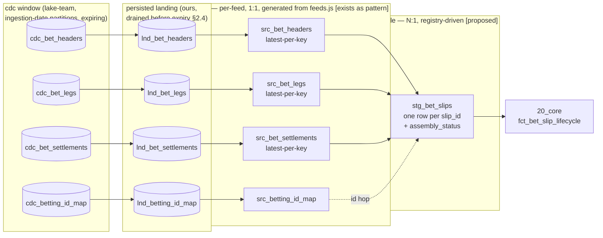
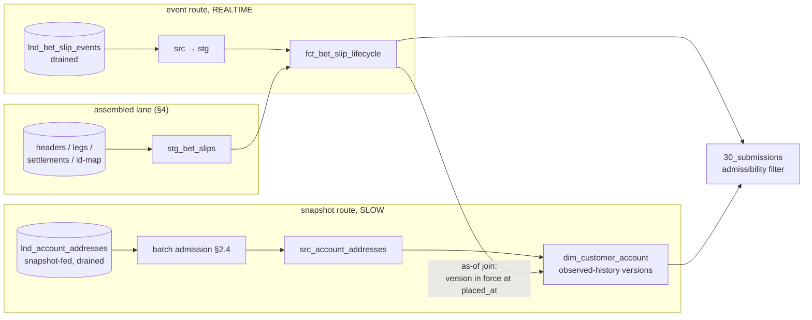

# Data Ingestion Pipelines

*An architecture exploration for the `cdc-transformations` work: what the
ingestion layer must become when three simplifying assumptions of the
current proof-of-concept are dropped. Companion to
[`dataform-example/ARCHITECTURE.md`](dataform-example/ARCHITECTURE.md)
(§3 data flow, §6 fault isolation) — this document goes deep on the
left-hand side of that DAG: everything between the distributed source
systems and the jurisdiction-agnostic core schemas, plus the
jurisdiction-specific lane through the extension mechanism.*

Throughout, mechanisms are marked **[exists]** (proven in the offline
harness today) or **[proposed]** (designed here, to be built on this
branch).

---

## 1. The three assumptions we are dropping

The current example pipeline makes three deliberate simplifications:

1. **Every CDC landing table maps 1:1 to a staging table.** Each
   `stg_*` model is a latest-per-key dedupe of exactly one `cdc_*`
   feed.
2. **Sources move at roughly one speed.** A single per-market
   `bet_settlement` watermark stands in for "the upstream is complete".
3. **The landing shape is ours to define.** The harness's fictitious
   `cdc_*` tables carry tidy `_op` / `_commit_ts` columns because the
   harness invented them.

None of the three survives contact with the real estate. The upstream
platform is **fully distributed**: accounts, wallets, bet capture,
settlement, payments, KYC and regulator integrations live in different
services publishing to Kafka topics — and **we do not consume those
topics ourselves**. The **data lake team** consumes them and appends
the latest version of each record to the `cdc_*` tables we read.
Slow-moving sources take a different path to the same destination:
periodic **snapshots** of the source systems land in data lake tables,
and those snapshotted feeds are likewise **written to `cdc_*`
tables**. Everything we consume is therefore a cdc table. The lake
team also runs its **own high-water-mark mechanism** — advanced only
when they are satisfied that all incoming data has been processed —
and the cdc tables are **partitioned on ingestion date with
housekeeping on older partitions**: the data is readable for a fixed
period only. Every definition along both paths — topic schemas,
append cadence, snapshot cadence, delete representation, HWM
semantics, retention — is owned upstream of us. Three consequences
follow:

- **Many-to-one with complex joins.** A staging entity is frequently
  *assembled* from several feeds — a bet slip from a header service, a
  legs/selections service and a settlement service; an account from a
  registration system and a KYC system — sometimes joined through
  id-mapping tables because the systems don't share a key scheme.
- **A velocity spectrum, driven by source volatility.** People place
  bets thousands of times more often than they change address. At our
  boundary this spectrum runs from near-real-time appends (bet events,
  game rounds) through daily snapshots (addresses, KYC) to monthly
  files (provider statements) — including feeds that are *silent for
  months because nothing happened*.
- **A take-it-as-it-comes contract, two hops removed.** What lands in
  a `cdc_*` table is *the latest version of a record as of its last
  append* — the consumption cycle on the event route, the snapshot on
  the snapshot route — stamped with *the time it was delivered*, and —
  only sometimes — *the time the event originally occurred*. Change
  history, delete signals, ordering guarantees and completeness
  signals vary per feed and are negotiable at best; whatever changed
  between two appends, we never see — and whatever was appended longer
  ago than the housekeeping window, we can no longer read (§2.4).

One constraint from the output side sharpens all of this:
**submissions to the regulator systems must happen in near
real-time** (§5.3). The boundary's cadences — append cycles, HWM
advances, snapshot schedules — are therefore not merely operational
facts but terms in a regulatory latency budget, and requirements flow
*backwards* from each regulator's window into the feeds.

The design goal is unchanged from the rest of the architecture:
**variance is data, logic is singular, and absence is never
ambiguous.** Ingestion variance — feed shapes, arrival routes, clocks,
join plans, velocities, attribute requirements — must be config that
generates SQL, not hand-written per-feed pipelines.

---

## 2. The boundary as given (not as we'd wish it)

### 2.1 Two arrival routes, one landing artifact

Everything we ingest is an append-only `cdc_*` table; what differs is
the upstream-owned route that fills it:

| Route | Path into `cdc_*` | What one appended row means | Cadence owner |
|---|---|---|---|
| **Event route** | source service → Kafka topic → **data lake team's consumer** → append | The key's **latest** version as of that append cycle (a row appears only in cycles where the key changed) | The lake team's append cycle |
| **Snapshot route** | source system → periodic snapshot → slow-moving lake table → **written to `cdc_*`** | The key's **latest** version as of that snapshot | The snapshot schedule |

Per appended row, reliably:

| Given | Meaning |
|---|---|
| **Payload** | The latest state of one record (one key), in the upstream's schema |
| **Delivery timestamp** | When the row was delivered to the cdc table (stamped at append) |

And only sometimes:

| Sometimes given | Meaning |
|---|---|
| **Event timestamp** | When the business event originally occurred at the source |
| **Delete signal** | However removals surface in the cdc table — a flagged row, or nothing at all |

And two standing facts of the boundary — properties of the tables, not
columns on any row:

| Boundary fact | Meaning |
|---|---|
| **The lake team's high-water mark (HWM)** | Advances only when they are satisfied that *all* incoming data has been processed — the authoritative completeness signal for the hops they own (§3.2) |
| **A finite window** | cdc tables are partitioned on **ingestion date**; housekeeping expires older partitions, so each table is a *sliding window*, not an archive (§2.4) |

Explicitly **not** given: intermediate versions (there are
**version-collapsing points at every hop** — topic compaction
upstream, latest-version-per-cycle appends on the event route, the
snapshot interval on the snapshot route; a key that changes twice
inside one cycle or between two snapshots lands once), cross-feed
ordering, a shared clock across feeds, exactly-once delivery, or any
history older than the housekeeping window.

### 2.2 The three clocks **[proposed]**

Every downstream rule in this document is expressed against exactly
three timestamps, so their meanings need to be nailed down once:

| Clock | Whose | Present | Used for |
|---|---|---|---|
| `event_ts` | The source's | per-feed (sometimes) | The only clock with *business* meaning: ordering versions of a key, as-of joins, effective-dating |
| `delivered_ts` | The boundary's (stamped at lake-team append / snapshot load) | always | Ordering our *observations*; liveness/watermark inference; the fallback ordering clock |
| `_ingested_at` | Ours | always (stamped as rows are drained into persisted landing) | Incremental processing windows, drain & batch-admission audit (§2.4) |

The ordering rule: **within one key of one feed**, versions are
ordered by `event_ts` where the feed carries one, else by
`delivered_ts`. **Across keys or across feeds, nothing is ordered** —
a settlement row can be appended before the bet header it settles
(§6/S3): the two cdc tables are filled by different consumers on
different cycles, and no rule anywhere may assume otherwise. Business
timestamps *inside* the payload (`placed_at`, `settled_at`) remain the
basis for report dates as today **[exists]**; the clocks above govern
ingestion mechanics only.

### 2.3 The feed registry **[proposed]**

Since every shape and cadence at the boundary is upstream's choice,
every fact about a feed that the pipeline must adapt to is declared in
one registry — the same move `providers.js` makes for game feeds
**[exists]**, widened to every ingested source. Onboarding a feed *is*
filling in this entry; each field is a question for the feed's owner —
usually the data lake team, sometimes the originating service team:

```js
// includes/feeds.js (proposed) — shape sketch
const feeds = {
  bet_headers: {
    route: "event",                            // event | snapshot
    cdcTable: "cdc_bet_headers",               // what we read
    upstreamTopic: "prod.betting.bet-headers.v3", // lineage + negotiation handle
    key: "slip_ref",
    eventTs: "occurred_at",                    // null if the feed has none
    deliveredTs: "delivered_at",
    deletes: "flag",                           // flag | none — how removals
                                               //   surface in the cdc table
    appendCadence: "PT5M",                     // the lake team's cycle — bounds
                                               //   both latency AND observability
    velocity: "REALTIME",                      // §3.1 — at OUR boundary
    cdcRetention: "P30D",                      // the housekeeping window (§2.4)
    retain: "P10Y",                            // OUR retention duty, post-drain
    watermark: { policy: "hwm", skewAllowance: "PT2M" },  // §3.2
  },
  account_addresses: {
    route: "snapshot",
    cdcTable: "cdc_account_addresses",         // what we read — same artifact
    sourceLakeTable: "lake.crm.customer_addresses", // lineage + reconciliation
    key: "account_id",
    eventTs: null,                             // ← a fact to surface, not hide (§6/S9)
    deliveredTs: "_loaded_at",
    deletes: "none",                           // removals not represented —
                                               //   a declared blind spot (§2.4)
    snapshotCadence: "daily by 06:00 UTC",
    velocity: "SLOW",
    cdcRetention: "P90D",
    retain: "P10Y",
    watermark: { policy: "cadence" },          // until HWM coverage of the
                                               //   snapshot writes is confirmed
  },
};
```

Note the velocity class describes arrival **at our boundary**, not at
the topic: a genuinely real-time topic behind a 15-minute append cycle
is `FAST` to us, and pretending otherwise miscalibrates every
tolerance downstream. The conform layer (§4.1) is *generated from*
these entries; a feed whose registry entry is incomplete fails
compilation, not month-end — the validator discipline **[exists]**
applied at the ingestion boundary.

### 2.4 The landing window: drained, verified, admitted **[proposed]**

This architecture's audit spine — as-filed reproduction, restatement,
deterministic recompute **[exists]** — depends on immutable,
replayable inputs *for years*. The boundary offers them *for weeks*:
the `cdc_*` tables are append-only, but they are partitioned on
ingestion date and **housekeeping expires older partitions** — each
table is a sliding window, not an archive. Durable history therefore
cannot live at the boundary; it must be secured on our side, inside
the window, every time. Three obligations:

1. **Drain before expiry.** A deliberately dumb copy job appends every
   new cdc partition, verbatim, into our own **persisted landing**
   (`lnd_*` — append-only, ours, stamped `_ingested_at`), with
   per-partition completeness accounting: rows drained must equal rows
   present, verified while the partition is still comfortably inside
   the window. A **drain-lag alarm** watches the age of the oldest
   unverified partition against the housekeeping horizon minus a
   safety margin — unlike ordinary staleness, this alarm has a hard
   deadline behind it: a partition that expires undrained is
   *permanently* lost (§6/S6). Drain does no transformation precisely
   so that almost nothing can break it; how long we then keep each
   feed is config (`retain` — a regulatory retention duty, not a
   storage preference). Everything downstream reads `lnd_*`, never
   `cdc_*` — the example repo's `cdc_*` models map onto this persisted
   layer.
2. **Verify the contract inside the window.** Trust, but assert:
   [proposed] landing assertions check that cdc tables behave as
   promised while readable — per-partition row counts never decrease
   before expiry, sampled rows are byte-stable, `delivered_ts` is
   present, and the lake team's HWM is sane (monotonic, never
   regressing). A violation is an incident with the lake team,
   surfaced by us before it surfaces in an audit.
3. **Admit batches, don't just receive them.** On the snapshot route
   the differencing happens upstream — what reaches the cdc table is
   its *outcome*, and a fault in the snapshot (a truncated load, a
   half-written lake table) arrives disguised as ordinary data: a
   flood of spurious changes or removals (§6/S5). [proposed] **Batch
   admission**: rows enter conform only as part of an admitted batch —
   one whose shape is sane for its feed (change volume inside the
   velocity class's plausible band, removal volume under threshold,
   expected refresh observed). An implausible batch is held,
   fail-closed, pending confirmation with the lake team, while
   conform keeps serving the last admitted state. And where a feed
   declares `deletes: "none"`, removals are invisible at our boundary
   by construction — the backstop is periodic reconciliation of
   conformed state against the feed's `sourceLakeTable`, with
   divergence routed as `DATA` exceptions.

Two honest costs, stated up front. First, at-least-once delivery means
duplicate observations — conform (§4.1) is idempotent latest-per-key,
so duplicates are boring. Second, **observation granularity is bounded
upstream**: by topic compaction, by the lake team's
latest-version-per-cycle append, and by snapshot cadence. A value that
changes twice inside one cycle is observed once (§6/S9). Persisted
landing records what was *observed at the boundary*, and the layers
above must be honest about the difference between observed history and
actual history (§5.1).

---

## 3. Velocity: making silence unambiguous

### 3.1 Velocity classes **[proposed]**

Each feed declares a velocity class in its registry entry — describing
arrival at our boundary (§2.3):

| Class | Cadence | Examples | Characteristic hazard |
|---|---|---|---|
| `REALTIME` | seconds–minutes | bet slip events, game rounds, BG NRA references | out-of-order arrival, torn assemblies |
| `FAST` | minutes | payments, platform sessions, wallet movements | append cycles straddling period close |
| `SLOW` | hours–days | KYC status, account addresses, limits (snapshot route) | **silence ambiguity** (nothing changed vs feed down) |
| `SNAPSHOT` | daily–monthly full files | ROFUS/CRUKS register dumps, provider statements | partial snapshot read as mass deletion |
| `DORMANT` | quarterly or rarer | licence catalogues, regulator code lists | feed rots unnoticed until it matters |

The class drives the staleness alarm threshold, the conservatism of
inferred watermarks (§3.2), and the default late-tolerance used by
assemblies (§4).

### 3.2 Watermarks anchored on the lake team's high-water mark **[proposed — extends the existing `cdc_source_watermarks`]**

The existing readiness gate **[exists]** reads
`cdc_source_watermarks.complete_through` per (source, market) and
fail-closes: no watermark, no ready period. The question this section
answers is *where the watermark value comes from* — and the boundary
supplies most of the answer: the lake team runs its **own high-water
mark, advanced only when they are satisfied that all incoming data has
been processed**. Our watermark's target meaning:

> **"If it had happened by T, it would be in the cdc table by now."**

The HWM is authoritative for every hop the lake team owns (topic
consumption, snapshot processing, the append itself), so the per-feed
policies collapse into a short hierarchy:

| Policy | Applies to | Derivation | Strength |
|---|---|---|---|
| `hwm` | any feed the lake team's HWM covers | take their HWM; subtract `skewAllowance` (declared max event-to-append lag) to state completeness in event time | authoritative for their hops — the default |
| `cadence` | feeds the HWM doesn't (yet) cover, with a known schedule | expected append run / snapshot write observed and sane ⇒ complete through the period it covers | moderate — trusts the schedule |
| `inferred` | everything else | complete through `max(delivered_ts) − allowance`, allowance set by velocity class | weakest; honest but conservative |

One caveat keeps everyone honest: **the HWM asserts that everything
*incoming* was processed — not that everything that *happened* became
incoming.** A source service that silently stops producing looks, from
the platform inward, exactly like a quiet day: the topic is empty, the
lake team is satisfied, the HWM advances. The residual blind spot is
the source→topic hop; the practical mitigations are per-feed drift
monitoring (`HWM − max(event_ts)` stretching beyond the feed's
velocity class flags a producer stall, for feeds that carry event
time) and the intake conversation with the *originating* team wherever
a filing deadline rides on producer liveness.

Silence then decomposes cleanly:

| Observation | Meaning | Action |
|---|---|---|
| No rows, HWM advancing | Genuinely nothing changed (as far as anything reached the platform) | None — periods close normally |
| No rows, HWM stalled | The lake team's pipeline is down, stuck or backlogged | Staleness alarm (ops); periods after the stall go `COMPLETENESS → WAITING_DATA` **[exists]** |
| Rows arriving, HWM stalled | Appends running ahead of their bookkeeping — the data is provisional | Alarm; consume only through the HWM (fail-closed) |

That last row states a general discipline worth making explicit:
**period-close outputs consume through the HWM, not through the last
row they can see.** Rows beyond the HWM exist but are not yet vouched
for; building filings on them risks torn reads the lake team would
have caught. (The one declared exception is the `eager` near-real-time
lane — §5.3 — whose regimes carry their own correction semantics.)
And as before, **staleness ≠ readiness**: staleness is operational
(liveness evidence overdue for the feed's velocity class); readiness
is a data signal (is the period closed?). A `DORMANT` feed is not
stale after a quiet week; a `REALTIME` feed is stale after five
minutes.

### 3.3 Readiness is scoped to what a file actually reads **[proposed]**

Today readiness is one watermark (`bet_settlement`) per market. With a
velocity spectrum that generalises badly: a monthly provider-statement
feed must not hold the *daily betting file* hostage — the betting file
never reads it.

So readiness becomes **field-set-scoped**: each output (a market's
betting file, its gaming file, its tax summary, a recon model)
declares — or has derived from its lineage — the set of feeds it
draws on, and its readiness is the AND over *only those* watermarks:

```
ready(market, period, output) =
  ∀ feed ∈ feeds(output):  watermark(feed, market) > close(period)
```

The daily MT betting file gates on bet capture + settlement + accounts
+ its declared extension feeds (§7.4); the monthly provider GGR recon
additionally gates on the statement snapshot; neither blocks the
other. The existing per-market `rg_period_readiness` becomes a
per-(market, output) matrix, and the `COMPLETENESS` exception routing
**[exists]** consumes it unchanged. (Near-real-time outputs don't use
period readiness at all — each *record* gates on its own dependencies;
§5.3.)

---

## 4. Many-to-one: staging becomes conform → assemble

### 4.1 Two stages, one contract

The 1:1 dedupe pattern is not discarded — it is demoted to the first
of two stages, and it remains the *only* thing allowed to touch
persisted landing:



- **Conform** (`src_*`): latest-per-key ordered by the feed's declared
  ordering clock (`event_ts` else `delivered_ts` — §2.2), drop deleted
  rows per the feed's declared delete semantics, cast types — and, for
  period-close consumers, take rows only through the feed's watermark
  (§3.2): rows beyond the HWM wait to be vouched for. One per feed,
  **generated from the feed registry** — the QUALIFY dedupe the
  example writes by hand today **[exists]** becomes the generated
  output of a `feeds.js` entry, and absorbs per-feed quirkiness
  (tombstone flags vs synthesised snapshot deletes vs no deletes at
  all) so nothing downstream ever sees it.
- **Assemble** (`stg_*`): joins N conformed sources into one business
  grain. Never reads landing directly, so every input is already
  deduplicated and delete-free — the join logic stays pure.

### 4.2 The assembly registry **[proposed]**

Assembly variance — which sources, which keys, which id-map hops,
which completeness rules, which survivorship — is data in a registry
(`includes/assemblies.js`), mirroring `providers.js` exactly: the
registry is config, the joining SQL is generated, and adding a source
system to an entity is a registry edit, not a SQL edit.

```js
// includes/assemblies.js (proposed) — shape sketch
const assemblies = {
  stg_bet_slips: {
    grain: "slip_id",
    sources: {
      hdr:  { from: "src_bet_headers",     key: "slip_ref", role: "anchor" },
      legs: { from: "src_bet_legs",        key: "slip_ref", role: "detail",
              fold: "collect" },            // 1:N folded to anchor grain
      stl:  { from: "src_bet_settlements", key: "bet_ref",  role: "outcome",
              via: "src_betting_id_map" },  // different key scheme → id hop
    },
    // completeness is decided by STATE, never by row-presence (§6/S3):
    completeness: {
      requires: [
        // an OPEN slip legitimately has no settlement — absence is correct
        { when: "hdr.status IN ('SETTLED','VOIDED')", need: ["stl"] },
        { when: "TRUE",                                need: ["legs"] },
      ],
    },
    survivorship: {                          // field → winning source
      stake:  "hdr", payout: "stl",
      tiebreak: "event_ts",                  // freshest wins — by WHICH clock is declared
      onConflict: "quarantine",              // irreconcilable → DATA class
    },
    watermark: "min",                        // fan-in: min over source watermarks
    lateTolerance: { legs: "PT15M", stl: "P3D" },
  },
};
```

Key design points:

- **The anchor role defines existence.** An entity exists when its
  anchor row exists. Detail/outcome rows without an anchor are
  *orphans* (S3); an anchor without a *required* companion is
  *pending*.
- **Completeness predicates are state-based.** The rule is never "a
  settlement row is present" but "a slip whose header says SETTLED
  must have its settlement row". This carries the absence taxonomy
  **[exists]** — "doesn't exist by state" vs "hasn't arrived" — down
  into the assembly layer, where it is decided once for everyone.
- **Fan-in watermark.** An assembled table's effective watermark is
  the `min` over its contributing feeds' derived watermarks (§3.2).
  Readiness (§3.3) composes through assemblies automatically: a file
  reading `stg_bet_slips` transitively gates on headers, legs,
  settlements *and the id-map feed* — forgetting the id-map is
  impossible because it is a declared source.
- **Survivorship is config — including its clock.** During migration
  parallel-run, two systems can emit the same entity (S7). Field-level
  source precedence plus a freshest-wins tiebreak resolves the benign
  overlap — and because feeds carry different clocks (§2.2), the
  tiebreak declares which one it trusts; comparing one feed's
  `event_ts` against another's `delivered_ts` is exactly the silent
  bug the declaration prevents. Irreconcilable conflict (two sources,
  two different national ids) routes the entity to
  `DATA → QUARANTINED` — a person must decide, and the entity is
  withheld from files while they do, without blocking anyone else
  **[exists — quarantine-first]**.

### 4.3 Assembly states → the existing exception taxonomy

Assembly produces a per-entity `assembly_status`, and every non-clean
state maps onto the existing four-class exception routing **[exists]**
rather than inventing a parallel mechanism:

| `assembly_status` | Meaning | Routed as |
|---|---|---|
| `ASSEMBLED` | All required companions present per state | — (flows to core) |
| `PENDING(role)` | Required companion absent, within `lateTolerance` | — (invisible to submissions; period likely not ready anyway) |
| `LATE(role)` | Required companion absent past tolerance | `TRANSIENT → RETRYING` with backoff, escalation, auto-`RESOLVED` on arrival **[exists]** |
| `ORPHANED(role)` | Detail/outcome with no anchor past tolerance | `DATA → QUARANTINED` (a key-mapping or feed bug — retrying can't help) |
| `CONFLICTED(field)` | Survivorship could not resolve | `DATA → QUARANTINED` |

The one hard gate is unchanged: no pending, late, orphaned, conflicted
or quarantined entity may ever appear in a submission
(`assert_no_blocked_entity_in_*` **[exists]**).

---

## 5. Into the core schemas

The core layer (`20_core`) keeps its two contracts — jurisdiction-
agnostic, and consuming *assembled* staging only — but latest-version
appends and the velocity spectrum add one intricacy worth making
explicit: **history is something we witness at the boundary, not
something we are sent.**

### 5.1 Three lanes, one core — and observed history



- **Fast facts** (bet events, rounds) flow through conform into facts
  essentially as today; the lifecycle pivot tolerates out-of-order
  arrival because it pivots the *event set*, not the arrival order
  **[exists]**.
- **Assembled facts** enter core only in `ASSEMBLED` state.
- **Slow dimensions** get history — but *observed* history. Because
  landing accumulates every version observed at the boundary (append
  cycles on the event route, snapshot writes on the snapshot route —
  §2.4), the dimension derives effective-dated rows
  from the observed chain: `valid_from` = the version's `event_ts`
  where the feed carries one, else its `delivered_ts` (an honest
  degradation: "in force since we saw it"). A bet then joins *the
  address and KYC status in force when it was placed* — which
  regulators actually ask for — rather than the current one. The
  caveat is structural, not fixable downstream: versions that lived
  and died inside one append cycle, one snapshot interval, or one
  compaction window never existed as far as the boundary can show
  (§6/S9). The slower the source, the less this matters in practice —
  but where a regulation genuinely requires true point-in-time state,
  that requirement flows *upstream* into feed intake: event
  timestamps on the topic, append-every-message for that feed, or a
  faster snapshot. That is a negotiation, and it belongs at
  onboarding (§2.3), not at incident time.
- **Admissibility stays at the submission layer** **[exists]**: core
  holds everything (including entities currently held or retrying —
  their history must accumulate); files carry only admissible,
  period-ready rows.

### 5.2 Restatement is the ingestion answer to retroactivity

A `SLOW` feed doesn't just deliver late — it can deliver
*retroactively*: a KYC revocation backdated three weeks, an address
correction whose `event_ts` sits inside last month. The ingestion
layer does not special-case this: landing is append-only, the
dimension history gains a corrected version, and any already-filed
period the correction touches is recomputed deterministically and
refiled as an **amended filing** with the as-filed original retained
**[exists — restatement via effective-dating]**. The only new
obligation is detection: a [proposed] `ops_restatement_candidates`
model flags (market, period) pairs where newly appended rows carry an
`event_ts` (or payload business date) inside an already-filed period.

### 5.3 Near-real-time submission: the constraint that flows backwards **[proposed]**

Everything above quietly assumed the pipeline's outputs are periodic
files. They are not only that: **submissions to the regulator systems
must happen in near real-time**. Per-record regimes — the BG NRA
registration, the NL CDB control record, the FR trace regime
**[exists as demo — the 3-second polling submission engine]** — expect
each reportable event within minutes of it happening, not at period
close. Five things follow.

**1. The latency budget is end-to-end, and mostly not ours.** A
record's path is: event → topic (producer) → lake consumption + append
(`appendCadence`) → HWM advance → drain → conform/assemble →
per-record gate → submission engine. Our stages can run as often as we
choose; the boundary's terms are fixed by the lake team. NRT
compliance per market is therefore *arithmetic over the feed
registry*: sum the worst-case terms along an output's feed chain and
compare with the regulator's window — a [proposed] compile-time intake
assertion per NRT output. A 15-minute append cycle under a
five-minute regulatory window is not an engineering problem, it is a
contract problem — and it must surface at onboarding, not at go-live.

**2. Two consumption disciplines, declared per output.** The HWM
discipline (§3.2) protects correctness but costs latency — the HWM
advances on the lake team's clock. Period outputs keep it. Each NRT
output declares, as config:

| Discipline | Behaviour | Fits regimes that… |
|---|---|---|
| `gated` | submit only rows the HWM has vouched for | tolerate the HWM's cadence inside their window, or have no correction path (right-first-time) |
| `eager` | submit as rows land, ahead of the HWM; **reconcile at the HWM**: once it passes T, re-derive everything submitted with `delivered_ts ≤ T` from vouched-for data and emit any diff as an amendment | are per-record *and correctable* — the regime's own amendment semantics (voids re-reported as amendments **[exists as demo]**) absorb the rare mismatch |

`eager` is safe *precisely because* those regimes are correction-
tolerant; which discipline each market's regime supports is a registry
fact, not a runtime judgement call.

**3. Per-record admissibility replaces period readiness.** A period
file ships when its whole field-set is complete (§3.3). An NRT record
ships when *its own* dependencies are satisfied: assembly `ASSEMBLED`,
blocking attributes attached, no exception hold — the existing
admissibility filter **[exists]**, evaluated continuously per record
instead of once at close. The exception machinery is unchanged, but
its cost model inverts: a `TRANSIENT` hold on a period file is
invisible if it resolves before close; a `TRANSIENT` hold on an NRT
record is *lateness*, measured against the regulatory window. The ops
surface gains an SLA clock per (market, output): the age of the
oldest reportable-but-unsubmitted record.

**4. NRT propagates cadence requirements backwards.** S1's shape turns
acute: if an NRT record's *blocking* fields depend on a `SLOW`
snapshot-fed dimension, a new player's first bet cannot ship inside
any plausible window. So a [proposed] validator rule walks each NRT
output's dependency chain: blocking dependencies must ride feeds whose
end-to-end cadence fits the output's window; slow feeds may contribute
only non-blocking enrichment (ship-and-amend) to NRT outputs. The same
field can be blocking for the period file and non-blocking for the NRT
record — both declarations, both checked. Cadence requirements are
output-driven and flow *upstream*; the feed registry is what makes
them checkable rather than discoverable.

**5. Mechanically: a thin NRT slice, not a fast full DAG.** Aggregates,
tax summaries and recon have no need to run every minute. The NRT path
is a *slice* — drain → conform → assemble → per-record gate →
submission queue — containing only the models the per-record regimes
need, tagged and scheduled at high frequency (the provable micro-batch
pattern: same generated SQL, same tests, faster clock — per-market
tags **[exists as pattern]**). Period outputs run their own cadence
over the same conformed data. One source of truth, two clocks; and the
drain (§2.4) inherits the fastest slice's cadence for the feeds that
lane reads, which costs little because drain is a copy.

---

## 6. Extreme scenarios, and what they force into the design

Each scenario is deliberately at an edge of the velocity × topology ×
contract space. "Naive failure" is what a 1:1, single-watermark,
trust-the-boundary pipeline would do.

### S1 — The bet that outruns its player

*A new player registers and bets within seconds. Bet events ride the
event route with a tight append cycle; the account record rides the
snapshot route, refreshed every 4 hours. The fact arrives hours before
its parent dimension.*

- **Naive failure:** inner join drops the bet silently, or an outer
  join ships a file row with NULL player fields — both regulatory
  incidents.
- **Design answer:** the fact stages and enters core; the *submission*
  join to `dim_customer_account` is mandatory, so the missing parent
  routes the entity `TRANSIENT → RETRYING` (reference lag — the
  existing region-lookup precedent, generalised). The account arrives
  on the next snapshot, the retry machine auto-`RESOLVED`s, the slip
  ships. If the parent never arrives, escalation to `QUARANTINED`
  surfaces a genuine integration bug. Nothing else's file is blocked.

### S2 — The address that changes once a decade

*The address snapshot delivers zero changed rows for five weeks. Is
that health or an outage? We run neither the snapshot job nor the
load.*

- **Naive failure:** either periods hang `WAITING_DATA` forever
  (watermark only advances with traffic) or the pipeline assumes
  health and files with stale KYC data during a real outage.
- **Design answer:** the lake team's HWM (§3.2) answers it
  authoritatively for every hop they own: five quiet weeks under an
  advancing HWM mean *nothing changed, as far as anything reached the
  platform* — periods close normally. A stalled HWM (or, under the
  `cadence` fallback, a missed snapshot write) trips the staleness
  alarm and holds only the affected periods, fail-closed. Silence is
  never *interpreted*; it is classified by the boundary's own
  completeness evidence. The residue is the source→topic blind spot
  (§3.2): a CRM that silently stopped *exporting* looks identical from
  the platform inward — which is exactly what the event-time drift
  monitor and the intake conversation with the originating team are
  for.

### S3 — The settlement that arrives before the bet

*The settlement feed's consumer and append job run hot; the header
feed's lane lags. A settlement row is appended with no bet to settle.
There is no cross-feed ordering (§2.2).*

- **Naive failure:** the join drops the settlement (it silently
  reappears later — or doesn't), or worse, code infers "unsettled"
  from the absence of a row it actually already received.
- **Design answer:** assembly is an order-tolerant state machine. The
  outcome row parks as an orphan-in-waiting; when its anchor lands,
  the entity assembles — regardless of append order. Past
  `lateTolerance` without an anchor it becomes `ORPHANED → DATA`
  (that's a key-mapping bug, not lag). And because completeness is
  state-based (§4.2), "no settlement row" is only ever a problem for
  slips whose *header state* demands one.

### S4 — The regulator inside the write path

*Bulgaria's NRA issues a real-time registration reference per bet
**[exists as an extension attribute]** — published by the regulator-
integration service to a topic, consumed by the lake team into a
`cdc_*` table, which the file cannot legally ship without. The NRA
endpoint goes down for six hours.*

- **Naive failure:** BG files ship with NULL references (regulatory
  breach), or the whole pipeline halts for every market.
- **Design answer:** the reference is a *blocking* extension attribute
  (§7.3) with its own derived watermark. During the outage, affected
  BG slips route `TRANSIENT → RETRYING`; every other market — and
  every BG slip that already has its reference — ships normally. When
  the NRA returns, the integration service republishes the issued
  references, the lake team's consumer appends them, retries resolve,
  the held slips ship. The surge of `RETRYING` rows against one
  `attr_name` is itself the outage dashboard.

### S5 — The register that arrives as a snapshot

*ROFUS / CRUKS / OASIS self-exclusion registers **[exist as
player-protection sources]** ride the snapshot route: presence on the
register means excluded, absence means not excluded. One night the
snapshot load truncates at 60%, and the upstream differencing dutifully
writes its outcome to the cdc table.*

- **Naive failure:** the truncation arrives *disguised as data* — a
  flood of removal rows (or, under `deletes: "none"`, thousands of
  exclusions silently frozen out of date) — and the pipeline
  un-excludes players wholesale, the worst possible compliance
  failure.
- **Design answer:** batch admission (§2.4). The batch's shape is
  insane for its feed — removal volume orders of magnitude outside the
  register's velocity class — so it is held, fail-closed, and conform
  keeps serving the last admitted state while the staleness clock runs
  and a human confirms with the lake team. Because exclusion is
  compliance-critical, the thresholds err asymmetrically: a suspicious
  flood of *additions* can be admitted (over-excluding is safe); a
  flood of *removals* never auto-admits. Within an admitted batch,
  absence **is** data; an unadmitted batch is lag. The two meanings
  never share a code path.

### S6 — The week-long outage and the flood

*The lake team's consumer for one feed dies for nine days — beyond the
topic's 7-day retention — then recovers and appends what the topic
still holds, all delivered in one afternoon, including changes to
periods already filed.*

- **Naive failure:** an incremental model keyed on a fixed "reprocess
  last 3 days of arrivals" window silently drops most of the
  recovery; ordering by delivery time interleaves nine days of history
  into one afternoon; the retention gap goes unnoticed.
- **Design answer:** four properties make the flood boring. Conform
  orders by `event_ts` where the feed carries it, so nine days
  appended in one afternoon still resolve to the right latest version
  per key **[exists as pattern]**; fail-closed readiness means the
  affected market's periods were `WAITING_DATA` all week, not
  mis-filed **[exists]**; restatement handles any period filed before
  the outage began **[exists]**; and [proposed] reprocessing windows
  are driven by the *content* of the recovery — everything since the
  oldest `event_ts` (else `delivered_ts`) observed in the batch —
  never by a constant. Two residues are the honest part. Whatever was
  appended before the outage survives in the cdc table (append-only —
  the topic forgetting it doesn't matter), but messages produced
  beyond retention *and never consumed* are simply gone: a detected
  gap is a `DATA` incident to reconcile with the lake team and the
  source system, not something to paper over. And the recovery itself
  is **collapsing**: the lake team appends the *latest* version per
  key per cycle, so a nine-day recovery consumed in one cycle lands
  one version per key — the outage doesn't just delay history, it
  thins it (S9's blind window, at outage scale). Both residues argue
  for the same intake asks: retention comfortably above worst-case
  recovery time, and append-every-message on feeds whose history is
  regulation-critical. And the scenario has a mirror on *our* side of
  the boundary: if the **drain** (§2.4) sleeps long enough for cdc
  housekeeping to approach undrained partitions, data the lake team
  delivered perfectly would expire unread. That is why the drain-lag
  alarm carries a hard deadline, why drain is deliberately the dumbest
  job in the system, and why its safety margin is sized against
  worst-case recovery time — a flood is survivable; sleeping through
  the window is not.

### S7 — Two systems claim the same customer

*During strangler-fig parallel-run, the legacy SQL Server estate and
the new platform both publish account feeds for migrated players —
same person, two feeds, different schemas, different clocks,
occasionally different values.*

- **Naive failure:** last-write-wins across feeds whose clocks and
  cadences differ — the surviving value is whichever feed happened to
  be appended last, and comparing legacy's event time against the new
  platform's delivery time makes the winner essentially random.
- **Design answer:** survivorship as config (§4.2): field-level source
  precedence (`kyc_status` from the system of record for KYC;
  `address` freshest-wins *on the declared tiebreak clock*), with the
  originating feed recorded on every landing row as lineage.
  Irreconcilable conflicts (differing national ids) quarantine the
  entity for human decision. When a market cuts over, its precedence
  entry is deleted — survivorship rules retire with the migration
  instead of fossilising in join SQL.

### S8 — The monthly file in a daily world

*Provider GGR statements arrive monthly (`SNAPSHOT`); betting files
ship daily. One watermark model must serve both.*

- **Naive failure:** a global "all feeds ready" gate blocks 30 daily
  files waiting for a statement none of them reads.
- **Design answer:** field-set-scoped readiness (§3.3). The daily
  betting file's feed set excludes statements entirely; the monthly
  `recon_provider_ggr` model gates on the statement watermark and
  closes when the statement lands. Slow feeds gate exactly the
  outputs that read them, and nothing more.

### S9 — The two changes we saw as one

*A player raises their deposit limit and lowers it again within
minutes. The limits topic isn't even compacted — but the lake team's
append cycle runs every 15 minutes and appends only the latest
version, so both changes fall inside one cycle and the cdc table shows
the final state, which equals the original. As far as our boundary
shows, nothing ever happened. A regulator later asks about a deposit
made that afternoon.*

- **Naive failure:** the pipeline presents its dimension history as
  *the* history and confidently asserts a limit that never applied —
  or worse, the discrepancy surfaces first in the regulator's own
  audit of the operator's front-end logs.
- **Design answer:** three layers of honesty. The dimension is
  explicitly **observed** history (§5.1) — its versions carry
  observation bounds, and claims about "the value in force at T" are
  claims about what the boundary showed. The feed registry makes the
  blind window a *declared, queryable fact* (`appendCadence` /
  `snapshotCadence`, `eventTs: null`, compaction upstream): a
  [proposed] intake assertion cross-checks the registry against the
  regulation-critical domains (limits, exclusions, KYC) and fails
  compilation where a domain that regulation audits point-in-time
  rides a feed whose blind window can't support it — forcing the
  upstream negotiation (event timestamps on the topic,
  append-every-message for that feed, or a faster cycle) *before* the
  market goes live, with the residual risk documented instead of
  discovered. Note that the HWM offers no help here: it vouches that
  everything *incoming* was processed, not that every intermediate
  version became incoming — completeness of processing is not
  completeness of observation (§3.2). The negotiation has a natural
  counterparty: one data lake team, whose append behaviour is per-feed
  configuration on their side too.

### S10 — The regulator that wants it in five minutes

*A market's per-record regime requires every settled bet reported
within five minutes. The bet feed's append cycle is one minute, but
its HWM advances roughly every ten; the KYC dimension rides a daily
snapshot.*

- **Naive failure:** waiting for the HWM makes every record twice the
  window late by design; submitting eagerly with no reconciliation
  lets a lake-team replay or correction contradict what was already
  sent, with no repair path; and a new player's first bet waits a day
  for its KYC enrichment — a guaranteed SLA breach baked into the
  dependency graph.
- **Design answer:** this output is declared `eager` (§5.3) because
  the regime is per-record and correctable: records ship on arrival —
  the registry arithmetic (producer skew + 1-minute append + slice
  cadence) fits the window — and the HWM reconciliation re-derives
  each submitted record once vouched-for data exists, emitting
  amendments for the rare mismatch through the regime's own correction
  semantics. The KYC fields are declared *non-blocking* for the NRT
  record (ship, amend if the dimension later disagrees) while staying
  *blocking* for the period file — the same field under two declared
  disciplines. And none of this was discovered in production: the
  backward cadence walk (§5.3) fails compilation the moment a
  daily-snapshot feed appears on a blocking path inside a five-minute
  window, forcing the design choice at onboarding.

---

## 7. The jurisdiction-specific lane: ingesting through the extension mechanism

The core schemas are jurisdiction-agnostic by contract. Everything a
single regulator uniquely needs arrives through the extension layer
**[exists]** — one generic carrier (`cdc_reg_attributes`:
`entity_type · entity_id · attr_name · attr_value`) plus a registry
(`includes/extensions.js`) of carrier-sourced and computed attributes,
opted into per market. That mechanism was designed from the *output*
side (how attributes reach a file). Upstream-owned, velocity-diverse
feeds force the *input* side to grow four things.

### 7.1 Heterogeneous origins, one carrier shape **[proposed]**

Jurisdiction-specific data arrives from wildly different origins, at
wildly different speeds, in shapes their owners chose:

| Origin | Example | Velocity | Arrival route |
|---|---|---|---|
| Regulator callback in the bet path | BG NRA registration id, DE LUGAS activity id | `REALTIME` | integration-service topic → lake team → `cdc_*` |
| Operator-side sidecar computation | DK SAFE TamperToken (signing service) | `REALTIME`/`FAST` | topic → lake team → `cdc_*` |
| Session-scoped third-party check | NL CRUKS check reference | `FAST` | topic → lake team → `cdc_*` |
| National register membership | ROFUS / CRUKS / OASIS / RGIAJ lists | `SNAPSHOT` | snapshot route → `cdc_*` |

The boundary rule: **per-entity report data rides the carrier;
register *memberships* do not.** A CRUKS *check reference* is a datum
about one bet → carrier. The CRUKS *register* is a set the player-
protection domain joins against → its own snapshot-route feed
**[exists]**, with S5's batch-admission discipline. Keeping registers out
of the carrier keeps the carrier's grain honest (one attribute value
per entity) and keeps register semantics (absence = not excluded)
inside the snapshot lane where they are safe.

Each carrier-sourced attribute references a **feed registry entry**
(§2.3) plus a mapping from that feed's shape to the carrier's:

```js
// includes/extensions.js (proposed additions to each carrier entry)
nra_registration_id: {
  entity: "SLIP",
  carrier: true,
  source: {
    feed: "nra_callbacks",              // → includes/feeds.js entry (route,
                                        //   clocks, deletes, watermark policy)
    map: { entityRef: "operator_bet_ref", value: "nra_ref" },
    via: "src_betting_id_map",          // regulator refs ≠ pipeline ids (§7.2)
  },
  required: "blocking",                 // §7.3
  description: "BG: NRA central-system real-time registration reference…",
},
```

A generated, registry-driven **carrier adapter** normalises each such
feed into carrier rows — so `cdc_reg_attributes` stops being a table
someone seeds and becomes the *converged output of N tiny generated
adapters*, one per jurisdiction-specific feed. Adding market #18's
bespoke datum remains: one feed entry + one registry entry. Still no
DDL on shared tables — and the upstream's shape stays the upstream's
business, absorbed entirely by the adapter's `map`.

### 7.2 Identity: regulator references are foreign keys in a foreign language

Regulator callbacks almost never speak the pipeline's ids — the NRA
echoes the operator's external bet reference; LUGAS issues its own
activity keys against a pseudonym. Every attribute source therefore
declares how its `entityRef` reaches a pipeline `entity_id`, usually
through the same conformed id-map sources assemblies use (`via:`). The
id-map feed thereby becomes a *declared source* of the attribute — so
its watermark automatically joins the attribute's readiness (§7.4),
and an id-map lag manifests as honest `TRANSIENT` holds rather than
attributes that mysteriously never attach.

Unmatchable carrier rows (a regulator reference whose operator ref
maps to nothing, past tolerance) are S3's orphans: `DATA →
QUARANTINED`, surfaced per `attr_name` — a standing integration-health
view of every regulator integration, for free.

### 7.3 Required vs optional — and *which* exception when it's missing **[proposed]**

Each declared attribute carries `required: "blocking" | "optional"`.
For a blocking attribute (the BG NRA id — the file is illegal without
it), a missing value must hold the slip. The intricacy is *which*
exception class — and the attribute feed's derived watermark answers
it, which is the absence taxonomy **[exists]** applied at attribute
grain:

| Value absent, and… | Meaning | Route |
|---|---|---|
| attribute feed's watermark **behind** the entity's event time | Hasn't arrived yet | `TRANSIENT → RETRYING` (S4) |
| attribute feed's watermark **past** it | Was never issued — genuinely missing mandatory datum | `DATA → QUARANTINED` |
| attribute is `optional` | Ship the correct empty value | — (not an exception) |

This one rule keeps the two failure modes — "the NRA is slow" and
"our bet-path integration failed to register the bet" — permanently
distinguishable, per row, mechanically. Its precision inherits from
the watermark policy (§3.2): under an `inferred` watermark the
boundary blurs by the width of the allowance, which is one more
reason a blocking attribute's feed deserves HWM coverage rather than a
fallback policy — and the validator can insist on exactly that. Where
the attribute feeds a near-real-time output (the NRA reference does),
the S10 discipline applies on top: the attribute is on the blocking
path, so its feed's end-to-end cadence must fit the regulator's
window — checked by the same backward cadence walk (§5.3).

### 7.4 Per-attribute readiness, folded into the same gate

Blocking attributes join the market's field-set-scoped readiness
(§3.3): a BG period is submittable only when bet capture, settlement,
accounts *and* the `nra_callbacks` feed (and its id-map) are complete
through the close. Optional attributes never gate a period. The
validator **[exists]** grows the matching pre-flight obligations: a
`blocking` attribute must reference a feed with `hwm` (or at minimum
`cadence`) watermark coverage; every carrier-sourced attribute must carry a
source descriptor; a market may not declare a blocking attribute whose
feed is unregistered. Misconfiguration fails compilation, not
month-end.

### 7.5 Corrections and reissues

Regulators reissue references; signing services re-sign. Because the
attribute feed delivers *latest-version* state (§2.1), a reissue is
simply a newer observation of the same key: the carrier is
latest-per-key **[exists]**, so the reissued value supersedes in the
next build, while the appended landing history retains the superseded
observation. If the superseded value was already *filed*, the
restatement path (§5.2) produces the amended filing — and as-filed
reproduction stays possible precisely because persisted landing
appends, never overwrites, and outlives the cdc window (§2.4). For
attributes where the regulator requires the *history* of values
(rather than latest), the attribute's staging follows the
slow-dimension pattern (§5.1): observed-history versions, selected
as-of the entity's report date — subject to the same S9 honesty about
blind windows.

### 7.6 Volume asymmetry: the carrier at both extremes

One table now carries Denmark's per-record signature (every DK slip),
Bulgaria's and Germany's per-bet references (every BG/DE slip), and
the Netherlands' two per-bet attributes — the carrier inherits the
*bet* velocity class, making it one of the largest, fastest tables in
the system, while simultaneously holding a handful of `DORMANT` rows.
That is fine — feeds converge on it without sharing a schedule — but
physically it must be partitioned by ingest date and clustered by
`(attr_name, entity_type, entity_id)` so each market's extension join
prunes to its own attributes, and per-`attr_name` row-count trends
belong on the ops dashboard: a flat-lining `cdb_record_id` count while
NL bets flow is an outage signal hours before any watermark stalls.

---

## 8. What changes versus the current example

| Concern | Today **[exists]** | This design **[proposed]** |
|---|---|---|
| Boundary | harness-invented `_op`, `_commit_ts` | lake-team-maintained `cdc_*` tables on both routes (Kafka topics appended latest-per-cycle; snapshotted lake feeds written to cdc), ingestion-date-partitioned under fixed-period housekeeping, completeness vouched by the lake team's HWM; per-feed facts in `includes/feeds.js` |
| Clocks | one `_commit_ts` | three-clock model: `event_ts` (sometimes), `delivered_ts` (always, stamped at the boundary), `_ingested_at` (ours, stamped at drain) |
| Submission cadence | periodic files | period outputs readiness-gated; NRT outputs per-record admissibility, `gated`/`eager` per regime, on a thin high-frequency slice (§5.3) |
| History | assumed present in landing | **witnessed, then secured**: the expiring cdc window drained into persisted landing (`lnd_*`) before housekeeping, verified by landing assertions; batch admission guards the snapshot route; observed-history honesty (S9) |
| Deletes | uniform `_op = 'D'` | per-feed: flagged rows / none (a declared blind spot with a reconciliation backstop) — absorbed by generated conform |
| Staging | one 1:1 dedupe stage (`stg_*`) | conform (`src_*`, generated from `feeds.js`) → assemble (`stg_*`, registry-driven N:1) |
| Assembly logic | n/a (1:1 assumed) | `includes/assemblies.js`: roles, id-map hops, state-based completeness, clock-declared survivorship, tolerances |
| Watermarks | per (source, market), data-driven | anchored on the lake team's HWM (advanced only when all incoming data is processed), with cadence/inferred fallbacks; period outputs consume only through the HWM; staleness ≠ readiness |
| Readiness | one source gates the market | field-set-scoped per output; fan-in `min` through assemblies |
| Slow dimensions | latest-per-key | observed-history versions, as-of joins at event time where the feed permits |
| Extension carrier input | seeded rows | generated per-attribute adapters over registered feeds; id-map hops |
| Extension semantics | attribute list per market | + `required: blocking/optional`, per-attribute-feed watermarks & readiness, watermark-resolved exception class |
| Exception taxonomy | DATA / TRANSIENT / COMPLETENESS / COMPLIANCE | unchanged — assembly states and attribute absences *route into it* |
| Hard gate | no blocked entity in any file | unchanged, now also covering pending/orphaned/conflicted assemblies |

The through-line: every new mechanism is the same three moves the
architecture already trusts — *declare variance as data in a registry,
generate the SQL, and resolve every ambiguity of absence into an
explicit, routable state* — applied to a boundary whose other side we
do not control.

---

## 9. Open questions for this branch

1. **Registry granularity.** Does `assemblies.js` subsume the existing
   provider registry (a provider feed is just an assembly with one
   source and a `fold`), or do they stay siblings? Leaning siblings:
   providers normalise *shape*, assemblies compose *entities* — and
   `feeds.js` now sits beneath both.
2. **The lake-team contract conversation.** Most intake questions now
   have a single counterparty: per feed — append cadence,
   append-every-message vs latest-per-cycle, how removals are
   represented in the cdc table (on both routes), the HWM's exact
   semantics (per feed or per pipeline? stated in delivery time or
   event time? exposed as a queryable table? does it cover the
   snapshot writes?), and each table's housekeeping window — with
   advance notice of changes, since the drain margin (§2.4) and the
   NRT latency arithmetic (§5.3) are both sized against these numbers.
   Which of these can be standing platform guarantees versus per-feed
   negotiations? Event timestamps remain a conversation with the
   originating service teams — the lake team can only pass through
   what the topic carries.
3. **Batch-admission calibration.** Admission bands (§2.4) need
   tuning per feed: too tight and routine variance holds healthy
   batches, too loose and S5 walks through. Where is the asymmetric
   principle encoded (compliance-critical feeds never auto-admit
   removal floods — the feed registry, or player-protection config)?
   And for `deletes: "none"` feeds, what reconciliation cadence
   against the `sourceLakeTable` is a sufficient backstop?
4. **Drain mechanics and verification depth.** Is the drain a Dataform
   action or a simpler copy job outside the DAG? Its hard-deadline,
   do-nothing-clever nature argues for the latter. And how paranoid
   should the window assertions be — per-partition row counts (cheap,
   catches truncation) versus sampled byte-stability versus full hash
   chains (strong, costly)? Likely tiered by how regulation-critical
   the feed is, which the registry already knows.
5. **Lineage-derived vs declared field-sets** for readiness scoping:
   deriving feed sets from the compiled DAG is more truthful;
   declaring them is more reviewable. Possibly derive, then assert the
   declaration matches (the `normalise()` twins pattern).
6. **The NRT slice's floor — and eager bookkeeping.** How fast can the
   thin slice (§5.3) actually cycle on BigQuery + Dataform, and for
   regimes whose window undercuts that floor, where does the
   streaming path (submission engine reading landing directly, the
   MIGRATION-GUIDE's known trap) take over from the modelled
   pipeline? Relatedly, `eager` reconciliation needs durable
   submission receipts to diff against re-derived records — the demo's
   `safe_submissions` receipts **[exists as demo]** are the precedent;
   their production shape (and the amendment audit trail) needs
   design.
7. **Offline harness parity.** Every scenario in §6 needs a negative
   test: a torn snapshot batch, an out-of-order settlement, a stalled
   HWM, a blocking attribute past its watermark, an append-cycle blind
   window (S9), a collapsed outage recovery (S6), an undrained
   partition approaching expiry (S6), an eager submission contradicted
   at the HWM (S10). The harness's fixed-clock determinism **[exists]**
   makes the tolerance/backoff cases testable; the seed layer needs
   per-feed shapes (append cycles, snapshot batches, HWM positions,
   missing event timestamps) added.
8. **Carrier scale-out.** If a single physical carrier table ever
   becomes a contention point, the registry already abstracts it —
   sharding by `entity_type` (or velocity class) would be invisible to
   every consumer.
