# Architecture

Config-driven regulatory reporting for a multi-jurisdiction gaming
platform: BigQuery + Dataform in production, DuckDB offline for rapid
development, designed so both humans and AI agents can maintain it
safely. Diagrams are Mermaid — they render in GitLab, GitHub and VS Code.

---

## 1. Where this sits: the migration context

The wider programme (see `MIGRATION-GUIDE.md` in the companion
`dataform-starter` repo) strangler-figs a 14-year legacy SQL Server
reporting estate. This repo is the target-state reporting core.

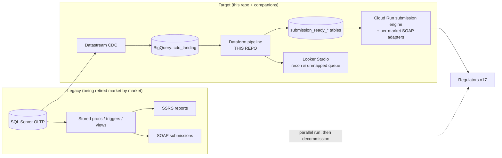

During migration, legacy outputs are landed back into BigQuery and
diffed against the new pipeline at three levels (totals, rows, fields)
until a market earns cutover — the recon generators for that live in the
`dataform-starter` companion and are open item #3 in `TODO.md`.

---

## 2. The code layering: config down to SQL

The single most important property: **every market difference is data,
every piece of SQL logic exists once.** Code flows downward only.

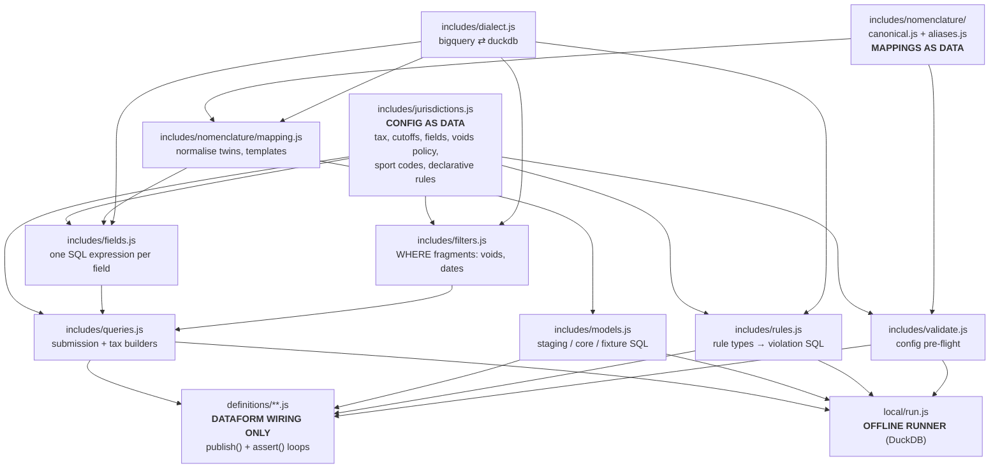

Consequences:

- **Adding market #3** touches one file (`jurisdictions.js`).
- **Adding a field** touches two (`fields.js` expression + the market's
  `reportFields`).
- **A regulator rule change** is a one-line diff with the clause id in
  the rule's `id`, giving a Git-native audit trail.
- The **blast radius of any change is mechanically visible**:
  `dataform compile` shows which tables changed; `npm run local` proves
  behaviour before anything touches the cloud.

### Jurisdiction extensions — variance in the DATA, not just the values

The mechanisms above turn *value/policy* variance into config. But some
regulators need a **datum no other market has** — Denmark's TamperToken
signature on each SAFE record, Bulgaria's real-time NRA registration
reference per bet, Greece's per-slip player-winnings withholding tax.
Widening the shared core table (and the global field registry) for each
of these is exactly how a model fills with single-market columns and
becomes unwieldy. The extension layer (`includes/extensions.js`) is the
escape hatch, and it keeps the core narrow:

```mermaid
flowchart LR
    CAR[(cdc_reg_attributes<br/>generic carrier:<br/>entity_type · entity_id ·<br/>attr_name · attr_value)]
    STG[stg_reg_attributes<br/>deduped latest-per-key]
    EXT["includes/extensions.js<br/>registry: carrier-sourced OR<br/>computed, per attr NAME"]
    CFG["jurisdictions.js<br/>extensions: ['nra_registration_id', ...]"]
    SUB[submission_ready_&#123;mkt&#125;<br/>market's file + its extension cols]

    CAR --> STG --> EXT
    CFG --> EXT --> SUB
```

- **Sourced attributes** ride in ONE generic carrier
  (`cdc_reg_attributes`, an `entity/attr` key-value table). Adding a
  market's bespoke datum = seed rows + one registry entry. **No DDL on
  any shared table, and no new per-market table.**
- **Computed attributes** are pure SQL over columns the core already
  carries, given a regulator-specific *output name* — so one expression
  (SHA-256 of the national id) surfaces as `player_dni_hash` /
  `player_egn_hash` / `player_afm_hash` without the global registry
  growing a near-duplicate per market. Greece's tiered withholding is
  generated from **bracket data in config**, so pinning the exact bands
  (or effective-dating them — TODO #1) stays config-only.
- A market opts in with `extensions: [...]` (mirroring `reportFields`).
  The validator checks each name and treats extension columns as part of
  the file, so **declarative rules target them for free** (e.g. BG's
  `matches` format rule on the NRA reference).

This is the provider-adapter idea (variance as config, normalising SQL
generated) applied to jurisdiction data-shape variance — the one gap the
architecture review flagged, now closed.

### Domains are opt-in per market

A market only materialises the domains it records. The betting domain is
universal here, but **gaming is optional** (`gamingNomenclature`
presence gates the whole gaming fan-out and its assertions). Denmark,
Bulgaria and Greece are betting-only examples; Malta and Spain carry
both. A market that doesn't offer a domain builds no empty tables for it.

---

## 3. The data flow (runtime DAG)

Numbered directory prefixes mirror this DAG. Staging and core are
jurisdiction-agnostic; fan-out to markets happens only at layer 30.

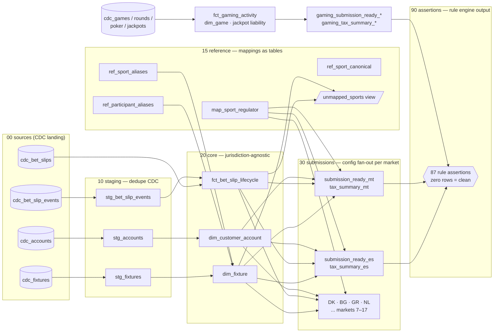

### The gaming domain (casino / poker / jackpots)

The gaming lane reuses every architectural mechanism: game-type
nomenclature runs through the same two-hop alias machinery (provider
labels → canonical types → MGA Types / DGOJ singular-licence codes),
per-market policy decides whether unmapped types default (MT → Type 1)
or block (ES — no licence, no offering), and revenue mechanics are
config-visible: casino GGR = stake − payout (− jackpot contribution per
policy), poker GGR = rake or tournament fee only. Progressive jackpots
divert ~1% of each wager to an operator-seeded, ring-fenced pool tracked
in `fct_jackpot_liability` (seed + contributions − wins ≥ 0); wins pay
from the pool, never from GGR.

### Operator-driven products: piggyback jackpots + the phantom game

The operator can layer its OWN game of chance on top of provider games
and sports bets: opted-in players auto-contribute from their unified
balance whenever they play (a provider round) or bet (a sports slip),
and can win an operator pool. The reporting challenge is that a regulator
requires every gaming **win to correlate to a licensed game/vertical** —
but this "win just for playing" has no underlying provider game, and the
sports-triggered contribution mustn't look like a betting product paying
casino wins. The solution is a **phantom game**: a catalogue entry
(`OJ1`, canonical type `OJACK`) that carries the contributions and wins.

It reuses every existing mechanism rather than adding a shape:

- Contributions/wins fold into `fct_gaming_activity` as vertical
  `OPERATOR_JACKPOT` (contribution = stake, win = payout) — so they flow
  into the gaming file, GGR (`= contributions − wins`), tax, **and** the
  exclusion breach detector, because they are simply gaming activities.
- The phantom game routes through the **two-hop nomenclature**: Malta
  licenses `OJACK` under MGA Type 1, so it maps and reports; Spain has no
  matching licence, so it stays unmapped and the cross-domain
  `no_unlicensed_games` rule **blocks the pipeline** — the licensing
  correlation is enforced for free (proven by a negative test).
- Pool liability lives in `fct_operator_jackpot_liability`
  (seed + contributions − wins ≥ 0), separate from the provider pools.
- Contributions **count toward the player's LOSS limit**: they land in
  `fct_player_gambling_activity` (the unified settled-bets + gaming
  wagering grain), which the `rg_breach_loss_limits` detector sums as
  net staked − won per market-local window. Deposit limits stay
  deposit-only (contributions are spend, not deposits).
- **Void/refund cascade**: if the trigger event is voided — a bet slip
  voided in the lifecycle, or a rolled-back round in
  `cdc_game_round_voids` — `fct_operator_jackpot_contributions` marks the
  contribution `REFUNDED`, and every consumer takes `ACTIVE` only, so the
  refund reverses cleanly out of the pool, GGR/tax and the loss base
  while the REFUNDED row stays as an audit trail.
- **Unified-balance debit**: each active contribution is also a
  `JACKPOT_CONTRIBUTION` debit in `fct_wallet_ledger` — the one balance
  that carries deposits, withdrawals, bet stakes/payouts and gaming
  stakes/payouts — and the wallet's jackpot debits **reconcile** against
  the pool's contributions. `dim_wallet_balance` is the running balance.

- **Sufficient-balance spend gate**: `rg_breach_wallet_overspend` (a
  pipeline-blocking assertion) flags any point where a player's running
  wallet balance goes negative — you can't spend money you don't have.

This product is now modelled end-to-end (correlation → licensing →
GGR/tax → pool → loss limit → refund cascade → wallet → spend gate),
with nothing scoped-out remaining.

### Multi-provider ingestion

Casino feeds arrive per provider, each shaped differently; the adapter
registry in `includes/providers.js` normalises them into one round grain.

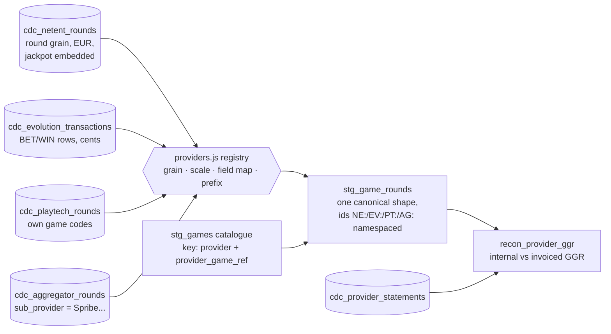

Provider quirks live only in the registry (grain, minor-unit scale,
field names, sub-provider routing); a new provider is one entry. The
recon model exists because revenue-share invoices are billed on the
provider's reported GGR — breaks are disputes to raise before paying.

### Player protection & payments

Cross-cutting compliance: limits, exclusions and KYC constrain every
other domain, so the breach detectors join across payments, betting and
gaming. Any row in a breach model is a regulatory breach; assertions
block the pipeline.

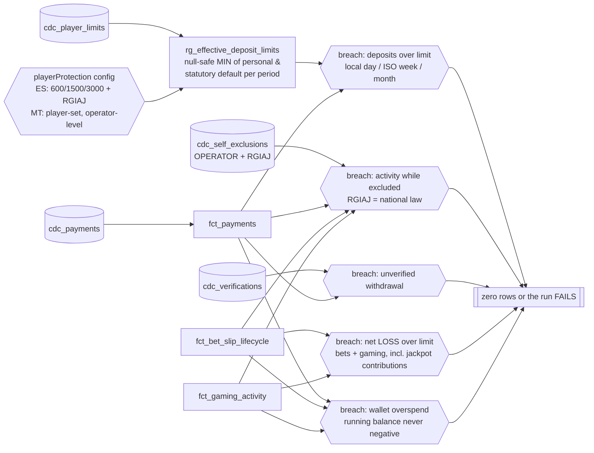

### The bet slip lifecycle

`fct_bet_slip_lifecycle` pivots the append-only event stream into one
row per slip. Invariants are executable rowCondition assertions.

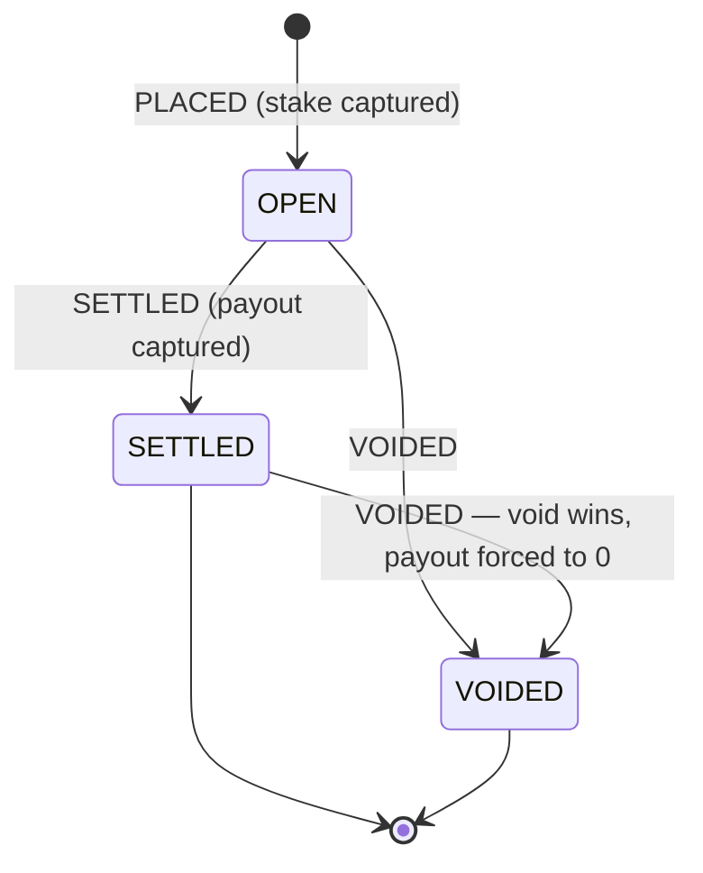

Invariants enforced: `SETTLED ⇒ settled_at set`, `VOIDED ⇒ voided_at
set`, `OPEN ⇒ neither`, `payout ≠ 0 ⇒ SETTLED`, `settled_at ≥ placed_at`.

---

## 4. Nomenclature: two-hop mapping

Upstream feed quality varies; every regulator has its own codes. Direct
upstream→regulator mapping would be an N×M maintenance disaster, so
everything routes through one canonical taxonomy.

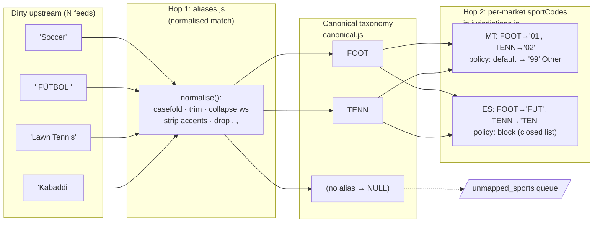

Key decisions:

- **`normalise()` (JS) and `normaliseText()` (SQL, per dialect) are
  documented twins** — aliases are normalised at compile time, upstream
  values at query time; matching only works if both agree, so they
  change together, guarded by tests.
- **Unmapped is a per-market policy, not an accident**: `'default'`
  degrades to the regulator's OTHER bucket; `'block'` keeps the code
  NULL and a mandatory `no_unmapped_fixtures` rule fails the run. The
  validator refuses a `'block'` market without the enforcing rule.
- **Participant display names degrade gracefully** to the raw upstream
  value; **regulatory codes never degrade silently**.

### The maintenance loop

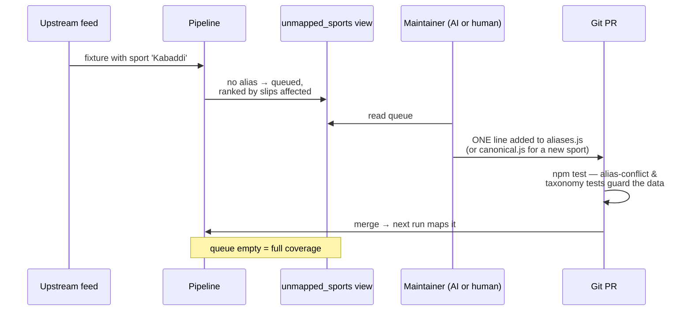

Resolving feed-quality problems is always a reviewable **data diff**,
never a SQL edit — the ideal shape for an AI agent to work autonomously
with tests as guardrails.

### Effective-dating (historical resubmissions)

Tax rates and regulator codes change over time, and a resubmission of a
historical period must reproduce the values that applied *then*. So a
`taxRate`, `sportCode` or `gameCode` in config may be a constant **or** a
time-versioned schedule (`includes/effective_dating.js`):

```
taxRate: [{ rate: 0.20, to: "2026-01-01" }, { rate: 0.25, from: "2026-01-01" }]
FOOT:    [{ code: "FUT", to: "2026-01-01" }, { code: "FTB", from: "2026-01-01" }]
```

Tax summaries apply the rate in force for each `report_date` (a `CASE`);
`map_sport_regulator` / `map_game_regulator` carry `valid_from`/`valid_to`
and the submission joins — plus the `no_unmapped_fixtures` /
`no_unlicensed_games` rules — filter on the report date. A Bulgaria file
resubmitted for a 2025 period therefore reports 20% GGR and the old `FUT`
football code, while 2026 uses 25% and the revised `FTB` — same config,
resolved by date. (Constant values are just a schedule of one, so nothing
changes for markets that don't version anything.)

---

## 5. The rule engine

Regulatory constraints are declarative data compiled into Dataform
assertions. An assertion query selects **violating rows**; zero rows
means compliant, any row blocks the pipeline before a file ships.

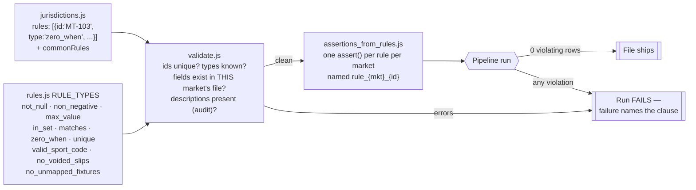

Adding a rule *type* means one entry in `RULE_TYPES` (a `validate` and a
`violations` function) plus tests; adding a rule *instance* is one
config line. The negative tests in the offline harness corrupt data on
purpose and prove rules actually catch it.

---

## 6. Fault isolation, data readiness & the exception flow

The rule engine (§5) guarantees **correctness** — the data that is present
is valid. A differential-speed, cross-domain reporting pipeline needs two
more things, both implemented in `includes/exceptions.js` (shared by the
runner and Dataform):

- **Fault isolation (quarantine-first).** A failure affects only its own
  row/entity — everyone else's report still ships. Nothing hard-aborts
  the whole run.
- **Completeness / data readiness.** Report fields draw on domains that
  move at different speeds; a period is only submittable once every
  upstream domain is complete *through the period close*.

### Two guarantees, not one

| | Correctness | Completeness |
|---|---|---|
| Question | Is the data present *right*? | Is *all* the data that should be present *here* (or confirmed absent)? |
| Mechanism | Rule assertions (§5) | Source watermarks + `rg_period_readiness` |
| Failure | Row routed to the exception flow | Period held until ready |

### The absence taxonomy (late vs. legitimately nonexistent)

The crux is telling *why* a field is empty. The pipeline **never infers
existence from a missing row** — it derives it from an explicit terminal
state, so "hasn't arrived" is never confused with "doesn't exist":

| Emptiness means… | How it's known | Routed to |
|---|---|---|
| **Not arrived yet** (reference/feed lag) | watermark behind / lookup missing | `TRANSIENT` → retry with backoff |
| **Period not closed** | source watermark < period close | `COMPLETENESS` → `WAITING_DATA` |
| **Legitimately nonexistent** | terminal **state** says so (an OPEN slip has no settlement; a losing slip has payout 0) | **shipped** as the correct empty value — *not* an exception |
| **Missing but mandatory** at deadline | a `not_null`/format rule fires | `DATA` → quarantine |
| **Compliance breach** | a `rg_breach_*` detector row | `COMPLIANCE` → per-entity `HELD` |

`fct_bet_slip_lifecycle` is the worked example: `reportDateExpr =
COALESCE(settled_at, voided_at)` means only **terminal** slips enter a
period's file. The seed's S6 is PLACED-only → it is correctly absent from
every file and is **not** an exception. That is "doesn't exist by state,"
proven — the failure mode of trigger-driven reporting (reading a
not-yet-written NULL and shipping it as 0) is structurally impossible.

### Routing, retry and the exception store

Each failing entity is routed by class into `fct_exceptions` (the
dead-letter / triage source). Transient failures carry a **retry state
machine** (`ops_exception_state_next`, persisted in `cdc_exception_state`):
exponential backoff (`15 · 2^(attempt-1)` min), escalation to
`QUARANTINED` after `MAX_ATTEMPTS`, and `RESOLVED` re-admission once the
late data arrives.

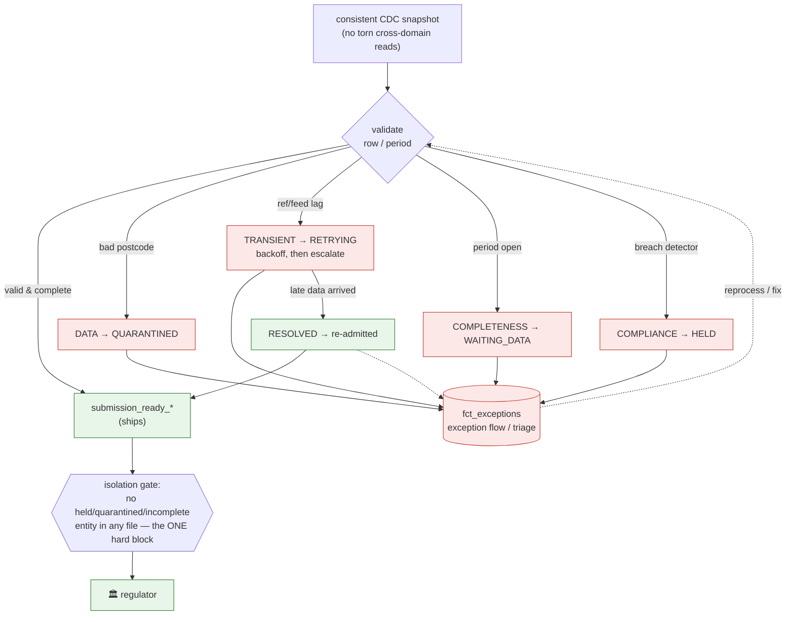

### Reconciling with the compliance gate

Under quarantine-first the `rg_breach_*` detectors **no longer hard-abort**
the run: a breaching entity is `HELD` and excluded from its file, while
everyone else ships (a per-entity gate, not a global one). Submissions and
tax apply one `admissibilityFilter` — a slip is admissible iff its account
has no blocking exception **and** its period is ready. The single invariant
that still hard-blocks is **isolation itself**: no held / quarantined /
incomplete entity may ever appear in a submission
(`assert_no_blocked_entity_in_*`), proven by a negative test that forces a
quarantined row into a file and watches the gate catch it.

### Late data after filing → restatement

Data that arrives *after* a period is filed is handled by **effective-dating
(§4)**: immutable CDC inputs + a deterministic recompute of that period +
versioned outputs = an **amended filing** with the original "as-filed"
version retained for audit — never a silent overwrite.

---

## 7. Two engines, one SQL source

All SQL is generated by pure JS functions, so production (BigQuery) and
offline development (DuckDB) share everything except a thin dialect.

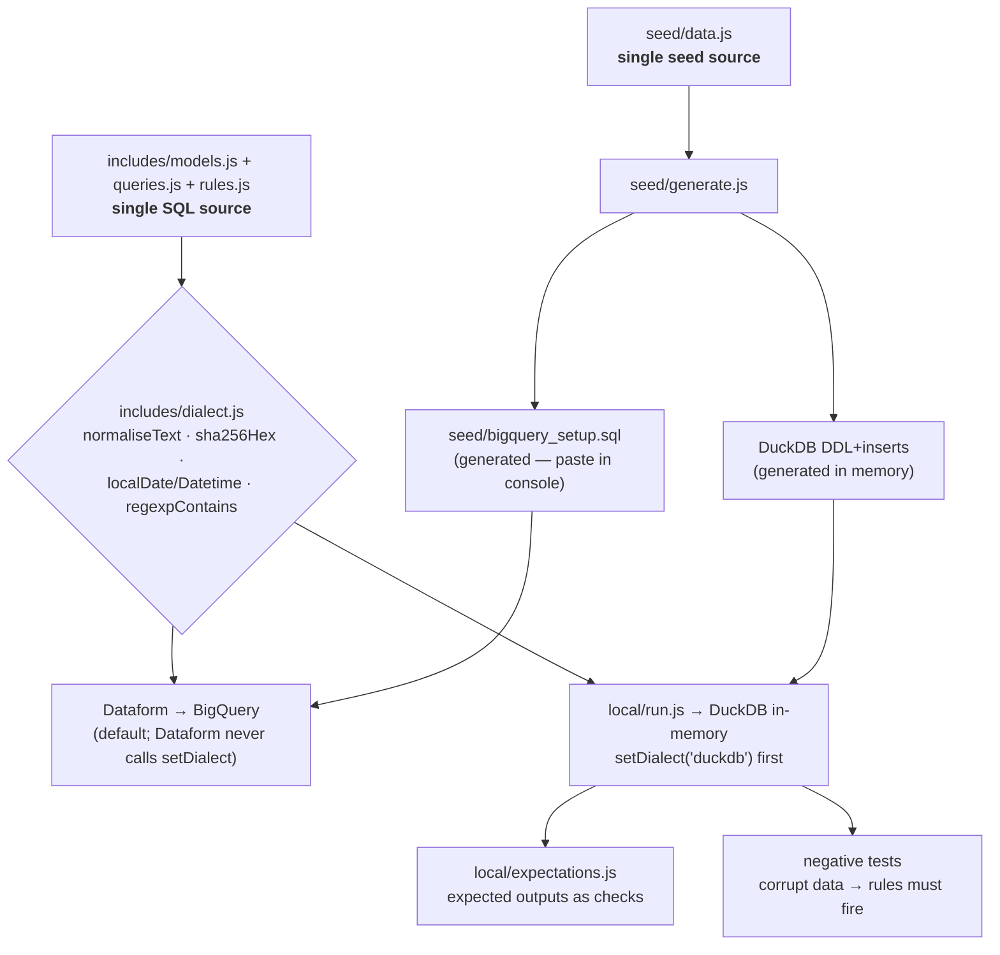

The offline run (`npm run local`) executes 66 models, 87 rule
assertions, 56 integration expectations and 16 negative tests in seconds.
It is the **definition of done** for any change; BigQuery deployment
becomes a formality rather than a test environment.

### What Dataform actually does here — and how offline works without it

[Dataform](https://cloud.google.com/dataform) is Google's SQL workflow
manager for BigQuery. Given table definitions, it compiles them into a
**dependency graph** (every `ctx.ref("x")` both resolves the table name
*and* declares "build me after x"), generates the **DDL** (table vs view vs
incremental, dataset, partitioning), **executes** the graph against BigQuery
in dependency order, and runs **assertions** afterwards — with tags,
scheduling and a UI on top.

**This project deliberately keeps Dataform thin.** In a standard Dataform
project the business SQL lives in `.sqlx` files that *only Dataform can
compile* — which would make offline execution impossible. Here, every
statement was moved into plain JS functions (`includes/models.js`,
`queries.js`, `rules.js`, …), and the `definitions/*.js` files contain **no
SQL at all** — only `publish()` wiring that hands those functions to
Dataform:

```js
// definitions/10_staging/staging.js — wiring only, no SQL
publish("stg_accounts", { type: "view", schema: "staging", ... })
  .query((ctx) => m.stgAccounts(ctx));      // the SQL lives in includes/
```

That one decision is what makes offline possible: because the SQL source is
ordinary JavaScript, **any host can call it** — Dataform is just one host.
`local/run.js` (~200 lines) is the other: a miniature stand-in that performs
each of Dataform's jobs without any Google dependency:

| Responsibility | Dataform (production) | `local/run.js` (offline) |
|---|---|---|
| Resolve `ctx.ref("x")` | Fully-qualified BigQuery name (`dataset.table`) + a graph edge | A flat in-memory namespace: `ref = (name) => name` |
| Dependency order | Derived automatically from the `ref` edges | The plan array, hand-ordered to the same topology (kept honest by execution: a wrong order fails immediately) |
| DDL & materialisation | `type: table/view/incremental`, datasets, `partitionBy` | Everything becomes `CREATE OR REPLACE TABLE … AS` in one in-memory DuckDB |
| Execution engine | BigQuery (builders emit BigQuery SQL — Dataform never calls `setDialect`) | Embedded DuckDB, after `setDialect('duckdb')` |
| Assertions | Dataform assertions, run post-build | The same violation queries executed directly; any row = failure |
| Beyond Dataform | — | Integration **expectations** (exact expected outputs) and **negative tests** (deliberate corruption that must be caught) |

What the offline harness deliberately does *not* replicate: BigQuery's
physical behaviours (partitioned/incremental merge semantics, dataset
separation — the flat namespace stands in) and Dataform's
scheduling/UI. That residue is why the workflow keeps `dataform compile` as
the blast-radius check and why real deployment (open item #5:
`workflow_settings.yaml` → a GCP project) remains the final formality — a
formality precisely because everything that can be proven without the cloud
already has been.

**"But where are the `.sqlx` files?"** There are none, by design — and none
are needed. Dataform has two first-class authoring formats: `.sqlx` files,
or its **JavaScript API** (`publish()` / `declare()` / `assert()` in
`definitions/*.js`). This project uses the JS API precisely so the SQL
builders are ordinary functions an offline runner can also call. The
complete Dataform artifact set is therefore just three things:

```
workflow_settings.yaml    the project config (GCP project, datasets, core version)
definitions/**/*.js       wiring: publish/declare/assert calls (no SQL inside)
includes/**/*.js          the shared builders and config (all the SQL)
```

One practical wrinkle: Dataform 3.x demands a **pure workspace** — it
refuses to compile if npm artifacts (`package.json`, `node_modules`) share
the directory, and those belong to the offline harness. So
`npm run dataform:compile` stages exactly those three artifacts into a temp
workspace and runs the **genuine `@dataform/cli`** against it. Verified:
the CLI compiles this project to **201 actions across 66 datasets** — the
same 66 models the offline harness executes, now fully qualified
(`staging.stg_accounts` [view], `core.dim_customer_account` [table], …)
with every rule as a named Dataform assertion. Deploying for real means
pushing that staged artifact set to the repository a Google Cloud Dataform
instance is connected to and pointing `workflow_settings.yaml` at the GCP
project.

---

## 8. Change workflows and their blast radius

| Change | Files touched | Verified by |
|---|---|---|
| New market | `jurisdictions.js` | validator + `npm run local` + `dataform compile` diff |
| New report field | `fields.js` + market's `reportFields` | `test/fields.test.js` + expectations |
| Market-specific attribute | `extensions.js` entry + market's `extensions` (+ carrier seed if sourced) | `test/extensions.test.js` + expectations |
| Regulator rule change | one rule line in config | rule assertion + negative test pattern |
| Feed-quality fix | one line in `aliases.js` | alias-conflict tests + queue empties |
| New domain (tables) | `seed/data.js`, `models.js`, `definitions/`, `expectations.js` | full offline run |
| Engine-specific SQL | `dialect.js` only (both engines + test) | `test/dialect.test.js` |

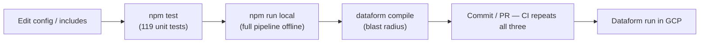

---

## 9. Why this is AI-maintainable (the design principles)

1. **Variance is data, logic is singular.** An agent asked to "add field
   X to the Malta file" has exactly two places to look, and the
   validator rejects anything structurally wrong before it compiles.
2. **Intent is stored next to mechanism.** Rules carry regulator clause
   ids and descriptions; CLAUDE.md states the layer contract; failures
   name the clause that fired.
3. **Everything is testable without infrastructure.** Unit tests for
   every generator, an offline pipeline as integration test, negative
   tests proving guardrails bite — an agent gets tight, fast feedback.
4. **Small pure functions, traceable in under a minute** from config to
   compiled SQL. Cleverness is deliberately capped: config objects +
   small functions + one loop per stage.
5. **Dangerous edits are structurally impossible to make quietly**:
   compilation fails on invalid config, assertions fail on bad data,
   and `dataform compile` exposes exactly which tables a diff touches.
