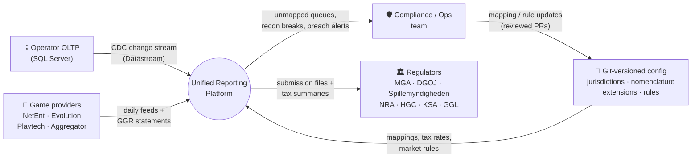
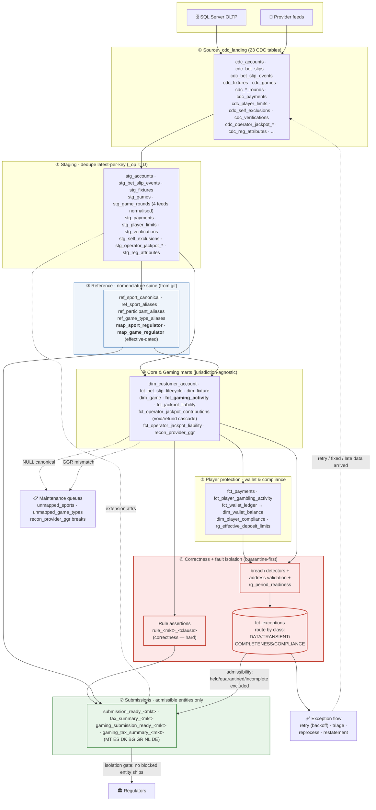
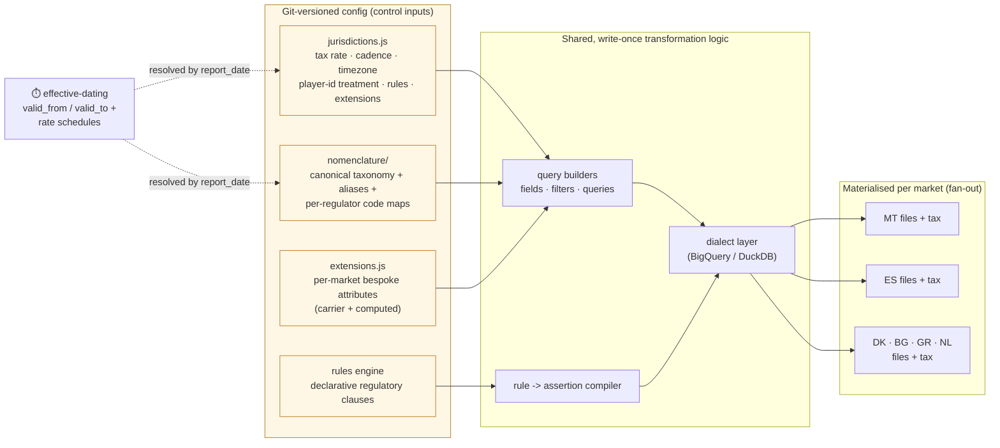
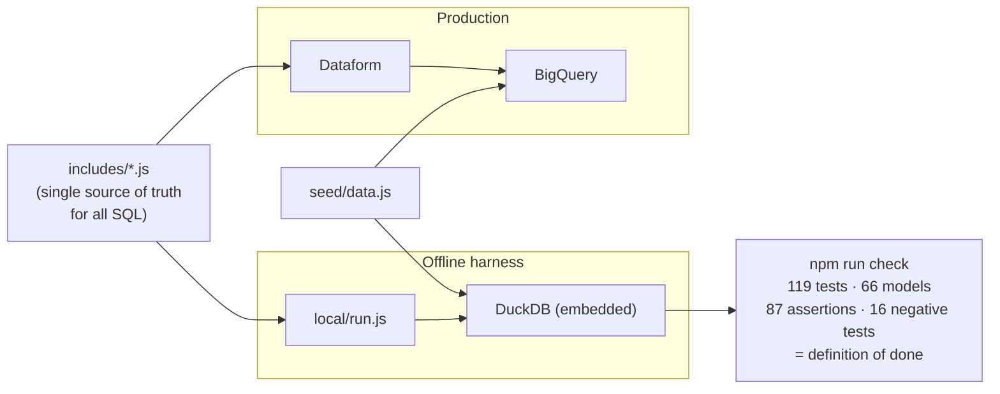

# Data Flow Diagram — Unified Regulatory Reporting Platform

How data moves from the operator's transactional systems, through the layered
transformation DAG, past the compliance gate, and out to each regulator — with
**config as data** driving the per-market fan-out. Three views:

1. **Context (Level 0)** — external entities and the system boundary
2. **Pipeline (Level 1)** — the layered processes, data stores, and the gate
3. **Config control plane** — how "variance as data" parameterises the DAG

---

## 1 · Context diagram (Level 0)

---

## 2 · Pipeline (Level 1) — the transformation DAG

Data flows top-to-bottom through materialised layers. Between the marts and the
regulator outputs sit **correctness rules** (hard-fail on invalid data) and
**fault isolation** (quarantine-first): a bad/late/held entity is routed to
`fct_exceptions` and excluded, while everyone else ships. **Nothing
held/quarantined/incomplete ever reaches a regulator** — the one hard block.

**Reading the gate (quarantine-first):** correctness rules still hard-fail on
invalid data. But a breach, a bad postcode, or an unready period no longer
aborts the run — the entity is routed into `fct_exceptions` (DATA→quarantine,
TRANSIENT→retry, COMPLETENESS→wait, COMPLIANCE→hold) and excluded from its file
by the admissibility filter, while everyone else ships. The one hard structural
block is **isolation itself**: no held/quarantined/incomplete entity may reach a
regulator. Legitimately-absent data (an OPEN slip's settlement) is shipped
correctly as empty — told apart from "late" by terminal *state*, not row-absence.
**Negative tests** prove each guardrail — including the isolation gate — fires.

---

## 3 · Config control plane — "market variance is data"

The same DAG serves every market. What differs between MT, ES, DK, BG, GR and NL
is **configuration**, not code — so a new market is a config change, not a new
pipeline.

**Effective-dating** closes the time dimension: a resubmission of a historical
period resolves the tax rate and regulator code that were *in force then*
(`valid_from`/`valid_to` on the maps, a rate schedule on the jurisdiction),
not today's values.

---

## 4 · Runtime paths — production vs offline

The identical model runs two ways; the offline path is the developer gate and
needs no cloud.

