# Logical ER Diagram — Unified Regulatory Reporting Platform

**Business/conceptual data model.** This view shows the *domain entities* the
platform reasons about and how they relate — independent of how they are
physically stored (CDC feeds, staging views, marts). One consistent model spans
every domain and every jurisdiction; jurisdiction variance is carried as **data**
(the `REGULATOR_CODE_MAP` and the `REG_ATTRIBUTE` extension carrier), never as
per-market entities. See `ER-PHYSICAL.md` for the persisted tables and
`DATA-FLOW.md` for how data moves between them.

Domains: **Accounts & Payments**, **Sports Betting**, **Gaming** (casino / poker /
jackpots), **Operator Opt-in Jackpot**, **Player Protection**, and the
**Regulatory / Nomenclature** reference spine.

---

## Full logical model

```mermaid
erDiagram
    JURISDICTION   ||--o{ ACCOUNT              : "licenses"
    JURISDICTION   ||--o{ REGULATOR_CODE_MAP   : "defines"
    JURISDICTION   ||--o{ REGULATORY_SUBMISSION: "receives"

    ACCOUNT        ||--o{ BET_SLIP             : "places"
    ACCOUNT        ||--o{ GAMING_ACTIVITY      : "plays"
    ACCOUNT        ||--o{ PAYMENT              : "transacts"
    ACCOUNT        ||--o{ PLAYER_LIMIT         : "sets"
    ACCOUNT        ||--o{ SELF_EXCLUSION       : "registers"
    ACCOUNT        ||--o{ VERIFICATION         : "undergoes"
    ACCOUNT        ||--|| WALLET_BALANCE        : "holds"
    ACCOUNT        ||--o{ JACKPOT_OPTIN        : "opts into"
    ACCOUNT        ||--o{ OP_JACKPOT_CONTRIB   : "contributes"

    FIXTURE        ||--o{ BET_SLIP             : "is bet on"
    SPORT          ||--o{ FIXTURE              : "classifies"
    SPORT          ||--o{ REGULATOR_CODE_MAP   : "is coded as"
    BET_SLIP       ||--o{ BET_SLIP_EVENT       : "has lifecycle"
    BET_SLIP       ||--o{ REGULATORY_SUBMISSION: "is reported in"
    BET_SLIP       ||--o{ REG_ATTRIBUTE        : "annotated by"

    GAME           ||--o{ GAMING_ACTIVITY      : "produces"
    GAME           ||--o{ OP_JACKPOT_CONTRIB   : "phantom carries"
    GAME_TYPE      ||--o{ GAME                 : "classifies"
    GAME_TYPE      ||--o{ REGULATOR_CODE_MAP   : "is coded as"

    PROV_JACKPOT_POOL ||--o{ PROV_JACKPOT_WIN  : "pays"
    GAMING_ACTIVITY   }o--o| PROV_JACKPOT_POOL : "contributes to"

    OP_JACKPOT_POOL   ||--o{ OP_JACKPOT_CONTRIB: "funded by"
    OP_JACKPOT_POOL   ||--o{ OP_JACKPOT_WIN    : "pays"
    BET_SLIP          ||--o{ OP_JACKPOT_CONTRIB: "triggers (sports)"
    GAMING_ACTIVITY   ||--o{ OP_JACKPOT_CONTRIB: "triggers (round)"

    PAYMENT         }o--|| WALLET_BALANCE      : "moves"
    BET_SLIP        }o--|| WALLET_BALANCE      : "moves"
    GAMING_ACTIVITY }o--|| WALLET_BALANCE      : "moves"

    ACCOUNT        {
        string  account_id       PK
        string  jurisdiction     FK "-> JURISDICTION.code"
        string  national_id          "raw / hashed / pseudonymised per market"
        string  kyc_status
        ts      opened_at
    }
    JURISDICTION   {
        string  code             PK "MT ES DK BG GR NL DE"
        string  regulator            "MGA DGOJ Spillemynd. NRA HGC KSA GGL"
        string  dataset              "reporting_<mkt>"
        num     tax_rate             "effective-dated schedule"
        num     gaming_tax_rate      "effective-dated schedule"
        string  submission_cadence   "daily / monthly"
        string  timezone
    }
    BET_SLIP       {
        string  slip_id          PK
        string  account_id       FK
        string  fixture_id       FK
        string  product
        string  slip_status          "OPEN / SETTLED / VOIDED"
        num     stake
        num     payout               "forced 0 when voided"
        ts      placed_at
        ts      settled_at
        ts      voided_at
    }
    BET_SLIP_EVENT {
        string  slip_id          FK
        string  event_type       PK "PLACED / SETTLED / VOIDED"
        ts      event_ts
        num     stake
        num     payout
    }
    FIXTURE        {
        string  fixture_id       PK
        string  canonical_sport  FK "NULL = unmapped -> queue"
        string  competition_name
        string  home_name
        string  away_name
        ts      start_ts
    }
    SPORT          {
        string  code             PK "canonical taxonomy"
        string  name
    }
    GAME           {
        string  game_id          PK
        string  game_name
        string  provider             "NetEnt Evolution Playtech operator"
        string  canonical_game_type FK "NULL = unmapped -> queue"
    }
    GAME_TYPE      {
        string  code             PK "canonical game type"
        string  name
    }
    GAMING_ACTIVITY {
        string  activity_id      PK
        string  account_id       FK
        string  game_id          FK
        string  vertical             "CASINO_ROUND / POKER_* / OPERATOR_JACKPOT"
        num     stake
        num     payout
        num     rake_or_fee
        num     jackpot_contribution
        ts      occurred_at
    }
    PROV_JACKPOT_POOL {
        string  jackpot_id       PK
        string  jackpot_name
        string  provider
        num     seed_amount
        num     contribution_rate
        num     pool_balance         "seed + contribs - wins >= 0"
    }
    PROV_JACKPOT_WIN {
        string  win_id           PK
        string  jackpot_id       FK
        string  account_id       FK
        num     amount
        ts      win_ts
    }
    OP_JACKPOT_POOL {
        string  jackpot_id       PK
        string  jackpot_name
        num     seed_amount
        num     pool_balance         "seed + active contribs - wins >= 0"
    }
    OP_JACKPOT_CONTRIB {
        string  contribution_id  PK
        string  account_id       FK
        string  jackpot_id       FK
        string  game_id          FK "phantom game OJ1"
        string  trigger_type         "SPORTS_BET / GAMING_ROUND"
        string  trigger_ref      FK "slip_id or round_id"
        num     amount
        string  status               "ACTIVE / REFUNDED (void cascade)"
        ts      contributed_at
    }
    OP_JACKPOT_WIN {
        string  win_id           PK
        string  jackpot_id       FK
        string  account_id       FK
        string  game_id          FK
        num     amount
        ts      win_ts
    }
    JACKPOT_OPTIN {
        string  optin_id         PK
        string  account_id       FK
        string  jackpot_id       FK
        ts      opted_in_at
        ts      opted_out_at
    }
    PAYMENT        {
        string  payment_id       PK
        string  account_id       FK
        string  direction            "DEPOSIT / WITHDRAWAL"
        num     amount
        string  method
        string  status               "REQUESTED / COMPLETED / FAILED"
        ts      requested_ts
        ts      completed_ts
    }
    PLAYER_LIMIT   {
        string  limit_id         PK
        string  account_id       FK
        string  limit_type           "DEPOSIT_* / LOSS_*"
        num     amount
        ts      set_at
        ts      revoked_at
    }
    SELF_EXCLUSION {
        string  exclusion_id     PK
        string  account_id       FK
        string  source               "OPERATOR / RGIAJ / ROFUS / CRUKS ..."
        ts      start_ts
        ts      end_ts               "NULL = indefinite"
    }
    VERIFICATION   {
        string  verification_id  PK
        string  account_id       FK
        string  check_type           "IDENTITY"
        string  status               "PENDING / VERIFIED"
        ts      event_ts
    }
    WALLET_BALANCE {
        string  account_id       PK
        string  jurisdiction
        num     balance              "SUM of signed ledger movements"
    }
    REGULATOR_CODE_MAP {
        string  jurisdiction     FK
        string  canonical            "canonical sport or game type"
        string  regulator_code       "per-regulator code"
        date    valid_from           "effective-dated"
        date    valid_to
    }
    REG_ATTRIBUTE  {
        string  entity_type      PK "SLIP / ACCOUNT ..."
        string  entity_id        PK
        string  attr_name        PK "nra_registration_id, cruks_check_ref ..."
        string  attr_value
    }
    REGULATORY_SUBMISSION {
        string  jurisdiction     FK
        date    report_date
        string  slip_id          FK
        string  regulator_code
        num     tax_due              "effective-dated rate applied"
    }
```

---

## How the model stays "write once, run every market"

| Concern | Where variance lives | Why it is *not* a new entity |
|---|---|---|
| Different regulator codes for the same sport/game | `REGULATOR_CODE_MAP` rows, keyed by `jurisdiction` + `canonical` | A row, not a table — and effective-dated so history reproduces |
| A datum only one market needs (e.g. BG `nra_registration_id`, NL `cruks_check_ref`) | `REG_ATTRIBUTE` key–value rows + one extension-registry entry | The shared entities never widen; carrier absorbs the difference |
| Different tax rate, cadence, timezone, player-id treatment | `JURISDICTION` attributes (config) | Attributes on one entity, resolved at query time |
| Rate/code that changed on a date | `valid_from` / `valid_to` on the mapping + a rate schedule | Time is data; a resubmission of an old period is exact |

The **breach entities** (deposit / loss / wallet-overspend / activity-while-excluded /
unverified-withdrawal) are *derived* views over these entities that must always be
empty — they are shown in `ER-PHYSICAL.md` and `DATA-FLOW.md` rather than here,
because logically they are constraints, not stored business objects.
