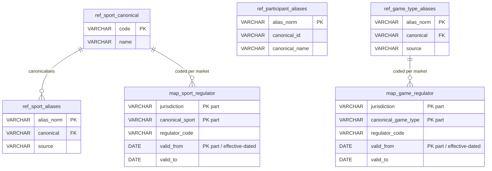
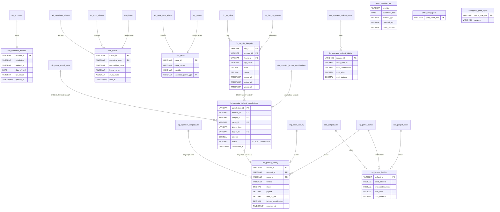
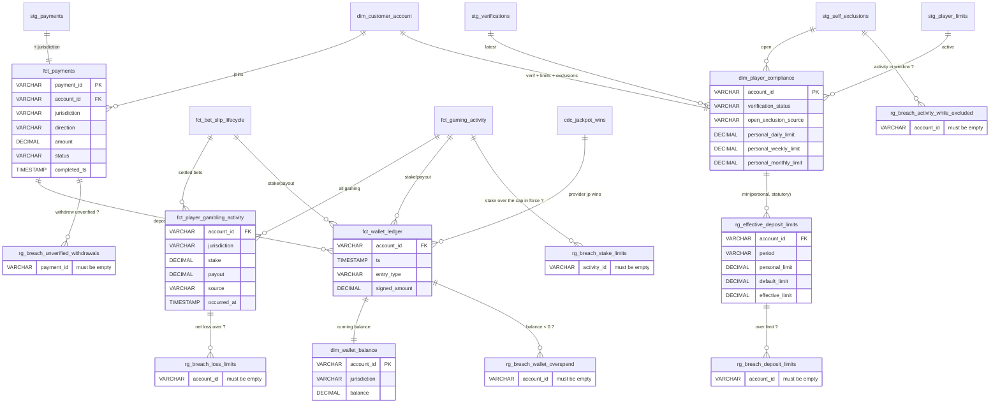
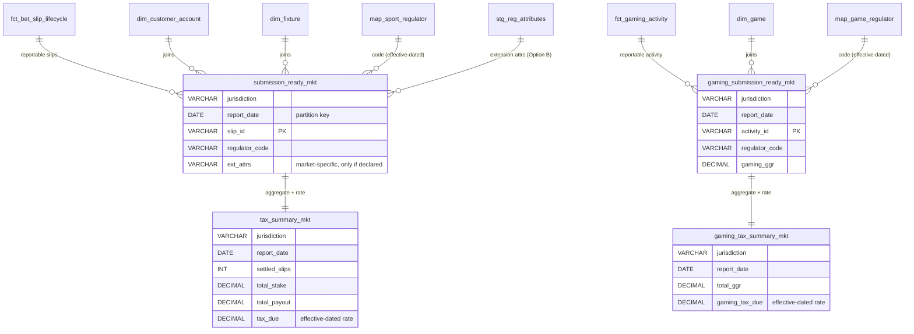

# Physical ER Diagram — Unified Regulatory Reporting Platform

**Persisted / materialised model.** These are the actual tables and views the
pipeline builds, with real column names and engine types. Production targets
**BigQuery + Dataform**; the offline harness builds the identical objects in
**DuckDB**. Types shown are logical (`VARCHAR`, `DECIMAL`, `TIMESTAMP`, `DATE`)
and map 1:1 to each engine via `includes/dialect.js`.

The pipeline is layered; each layer is a separate diagram below so it stays
readable:

1. **Source** — `cdc_landing.*` (23 CDC tables, populated by Datastream)
2. **Staging** — `staging.stg_*` (dedupe latest-per-key, `_op != 'D'`)
3. **Reference** — `reference.*` (nomenclature spine, from git-versioned data)
4. **Core & Gaming** — `dim_*` / `fct_*` marts
5. **Player Protection** — wallet, compliance, and the 6 breach detectors
6. **Submissions** — per-market regulator files + tax summaries

> Every `cdc_landing` table also carries CDC metadata columns `_op` (`I`/`U`/`D`)
> and `_commit_ts` (`TIMESTAMP`), used by staging to keep the latest non-deleted
> row per business key. They are omitted from the diagrams to reduce noise.

---

## 1 · Source layer — `cdc_landing`

Landing tables written by Datastream from the operator's SQL Server OLTP. Grain
and shape are whatever the upstream system emits (including provider feeds of
differing grain — Evolution is transaction-grain in cents).

```mermaid
erDiagram
    cdc_accounts {
        VARCHAR   account_id
        VARCHAR   jurisdiction
        VARCHAR   national_id
        DATE      date_of_birth
        VARCHAR   kyc_status
        TIMESTAMP opened_at
    }
    cdc_bet_slips {
        VARCHAR   slip_id
        VARCHAR   account_id
        VARCHAR   fixture_id
        VARCHAR   product
    }
    cdc_bet_slip_events {
        VARCHAR   slip_id
        VARCHAR   event_type
        TIMESTAMP event_ts
        DECIMAL   stake
        DECIMAL   payout
    }
    cdc_fixtures {
        VARCHAR   fixture_id
        VARCHAR   sport_name_raw
        VARCHAR   competition_raw
        VARCHAR   home_raw
        VARCHAR   away_raw
        TIMESTAMP start_ts
    }
    cdc_reg_attributes {
        VARCHAR   entity_type
        VARCHAR   entity_id
        VARCHAR   attr_name
        VARCHAR   attr_value
    }
    cdc_games {
        VARCHAR   game_id
        VARCHAR   game_name
        VARCHAR   provider
        VARCHAR   provider_game_ref
        VARCHAR   game_type_raw
    }
    cdc_netent_rounds {
        VARCHAR   round_ref
        VARCHAR   player_ref
        VARCHAR   game_ref
        DECIMAL   bet_amount
        DECIMAL   win_amount
        DECIMAL   jp_contribution
        VARCHAR   jp_id
        TIMESTAMP round_ts
    }
    cdc_evolution_transactions {
        VARCHAR   tx_id
        VARCHAR   round_ref
        VARCHAR   player_ref
        VARCHAR   table_ref
        VARCHAR   tx_type
        DECIMAL   amount_cents
        TIMESTAMP tx_ts
    }
    cdc_playtech_rounds {
        VARCHAR   round_ref
        VARCHAR   player_ref
        VARCHAR   game_code
        DECIMAL   stake
        DECIMAL   payout
        TIMESTAMP round_ts
    }
    cdc_aggregator_rounds {
        VARCHAR   round_ref
        VARCHAR   sub_provider
        VARCHAR   player_ref
        VARCHAR   game_ref
        DECIMAL   bet
        DECIMAL   win
        TIMESTAMP round_ts
    }
    cdc_provider_statements {
        VARCHAR   provider
        DATE      statement_date
        DECIMAL   reported_ggr
    }
    cdc_poker_activity {
        VARCHAR   activity_id
        VARCHAR   account_id
        VARCHAR   game_id
        VARCHAR   kind
        DECIMAL   amount_in
        DECIMAL   amount_out
        DECIMAL   rake_or_fee
        TIMESTAMP activity_ts
    }
    cdc_player_limits {
        VARCHAR   limit_id
        VARCHAR   account_id
        VARCHAR   limit_type
        DECIMAL   amount
        TIMESTAMP set_at
        TIMESTAMP revoked_at
    }
    cdc_self_exclusions {
        VARCHAR   exclusion_id
        VARCHAR   account_id
        VARCHAR   source
        TIMESTAMP start_ts
        TIMESTAMP end_ts
    }
    cdc_verifications {
        VARCHAR   verification_id
        VARCHAR   account_id
        VARCHAR   check_type
        VARCHAR   status
        TIMESTAMP event_ts
    }
    cdc_payments {
        VARCHAR   payment_id
        VARCHAR   account_id
        VARCHAR   direction
        DECIMAL   amount
        VARCHAR   method
        VARCHAR   status
        TIMESTAMP requested_ts
        TIMESTAMP completed_ts
    }
    cdc_jackpot_pools {
        VARCHAR   jackpot_id
        VARCHAR   jackpot_name
        VARCHAR   provider
        DECIMAL   seed_amount
        DECIMAL   contribution_rate
    }
    cdc_jackpot_wins {
        VARCHAR   win_id
        VARCHAR   jackpot_id
        VARCHAR   account_id
        DECIMAL   amount
        TIMESTAMP win_ts
    }
    cdc_operator_jackpot_pools {
        VARCHAR   jackpot_id
        VARCHAR   jackpot_name
        DECIMAL   seed_amount
    }
    cdc_jackpot_optins {
        VARCHAR   optin_id
        VARCHAR   account_id
        VARCHAR   jackpot_id
        TIMESTAMP opted_in_at
        TIMESTAMP opted_out_at
    }
    cdc_operator_jackpot_contributions {
        VARCHAR   contribution_id
        VARCHAR   account_id
        VARCHAR   jackpot_id
        VARCHAR   game_id
        VARCHAR   trigger_type
        VARCHAR   trigger_ref
        DECIMAL   amount
        TIMESTAMP contributed_at
    }
    cdc_operator_jackpot_wins {
        VARCHAR   win_id
        VARCHAR   jackpot_id
        VARCHAR   account_id
        VARCHAR   game_id
        DECIMAL   amount
        TIMESTAMP win_ts
    }
    cdc_game_round_voids {
        VARCHAR   round_id
        TIMESTAMP voided_at
    }
```

---

## 2 · Staging layer — `staging` (views: dedupe latest-per-key)

Each `stg_*` is a **view** that keeps one row per business key (latest
`_commit_ts`, dropping `_op = 'D'`). The four provider feeds collapse into one
normalised `stg_game_rounds` via the adapter layer (`includes/providers.js`),
which also converts Evolution's cent transactions into euro rounds.

```mermaid
erDiagram
    cdc_accounts               ||--o| stg_accounts                        : dedupe
    cdc_bet_slip_events        ||--o| stg_bet_slip_events                 : dedupe
    cdc_fixtures               ||--o| stg_fixtures                        : dedupe
    cdc_reg_attributes         ||--o| stg_reg_attributes                  : dedupe
    cdc_games                  ||--o| stg_games                           : dedupe
    cdc_netent_rounds          ||--o| stg_game_rounds                     : "normalise (adapter)"
    cdc_evolution_transactions ||--o| stg_game_rounds                     : "cents to rounds"
    cdc_playtech_rounds        ||--o| stg_game_rounds                     : normalise
    cdc_aggregator_rounds      ||--o| stg_game_rounds                     : normalise
    cdc_poker_activity         ||--o| stg_poker_activity                  : dedupe
    cdc_operator_jackpot_contributions ||--o| stg_operator_jackpot_contributions : dedupe
    cdc_operator_jackpot_wins  ||--o| stg_operator_jackpot_wins           : dedupe
    cdc_player_limits          ||--o| stg_player_limits                   : dedupe
    cdc_self_exclusions        ||--o| stg_self_exclusions                 : dedupe
    cdc_verifications          ||--o| stg_verifications                   : dedupe
    cdc_payments               ||--o| stg_payments                        : dedupe

    stg_accounts { VARCHAR account_id PK }
    stg_bet_slip_events { VARCHAR slip_id "PK part" VARCHAR event_type "PK part" }
    stg_fixtures { VARCHAR fixture_id PK }
    stg_reg_attributes { VARCHAR entity_type "PK" VARCHAR entity_id "PK" VARCHAR attr_name "PK" }
    stg_games { VARCHAR game_id PK }
    stg_game_rounds { VARCHAR round_id PK VARCHAR account_id FK VARCHAR game_id FK DECIMAL wager DECIMAL payout DECIMAL jackpot_contribution VARCHAR jackpot_id }
    stg_poker_activity { VARCHAR activity_id PK }
    stg_operator_jackpot_contributions { VARCHAR contribution_id PK }
    stg_operator_jackpot_wins { VARCHAR win_id PK }
    stg_player_limits { VARCHAR limit_id PK }
    stg_self_exclusions { VARCHAR exclusion_id PK }
    stg_verifications { VARCHAR verification_id PK }
    stg_payments { VARCHAR payment_id PK }
```

---

## 3 · Reference layer — `reference` (nomenclature spine)

Published from **git-versioned** mapping data (`includes/nomenclature/`), so a
mapping change is a reviewable data diff with a full audit trail. The two
`map_*_regulator` tables are **effective-dated** (`valid_from` / `valid_to`), so
a resubmission of a historical period reproduces the code that was in force then.

---

## 4 · Core & Gaming marts — `dim_*` / `fct_*`

The jurisdiction-agnostic canonical facts and dimensions. `fct_gaming_activity`
unifies casino rounds, poker, and the operator opt-in jackpot (contributions &
wins on the phantom game) onto one grain.

---

## 5 · Player protection — wallet, compliance, breach detectors

The **breach detectors** (`rg_breach_*`) each select rows that constitute a
regulatory breach. Under **quarantine-first** (see `DATA-FLOW.md` and
`ARCHITECTURE.md` §6) a breach no longer aborts the run — it feeds a per-entity
`HELD` exception in `fct_exceptions` and the entity is excluded from its file,
while everyone else ships.

---

## 6 · Submission layer — per-market regulator outputs

The fan-out: **one definition, two tables per market** for betting
(`submission_ready_<mkt>`, `tax_summary_<mkt>`) and two for gaming
(`gaming_submission_ready_<mkt>`, `gaming_tax_summary_<mkt>`, only where the
market declares a gaming nomenclature — MT & ES). Seven markets: MT, ES (daily);
DK, BG, GR, NL (monthly).

> `_mkt` is a placeholder for each of the six market codes: `mt`, `es`, `dk`,
> `bg`, `gr`, `nl`. The `submission_ready_*` tables are incremental and
> partitioned by `report_date`.
